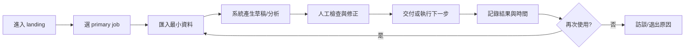
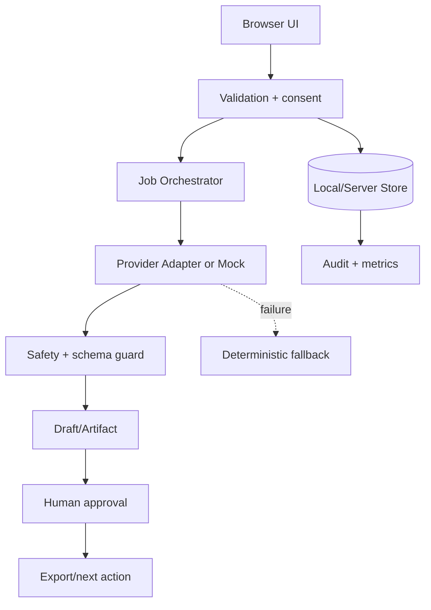
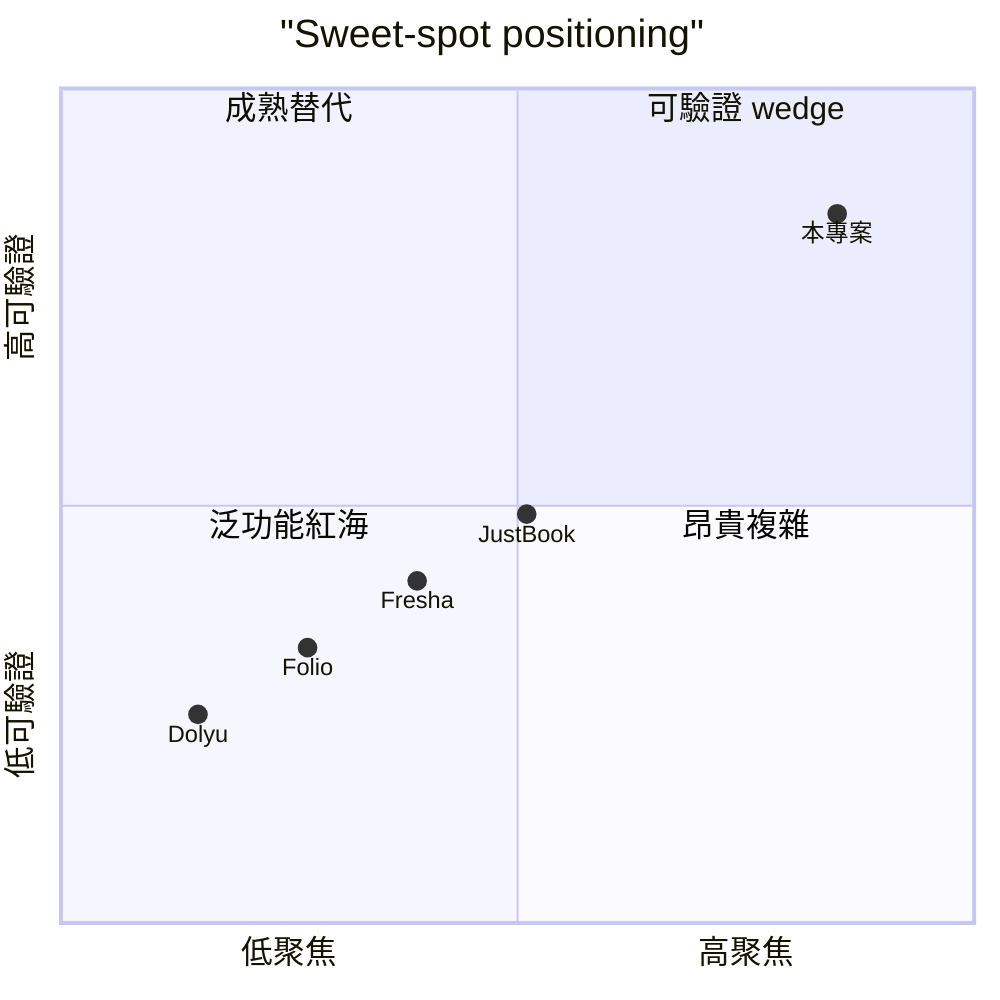

# Beauty CRM｜療程回流與客戶記憶工作台 — 規格計劃書 v2.2.1

> 版本：v2.2.1｜更新日期：2026-07-19｜維護者：Sean PRD Rewrite Specialist｜對接技術：Hermes Agent + engineering
> 文件狀態：sweet-spot-driven rewrite；不執行任何專案 kill。
> 原始碼：https://github.com/openclawsean024-create/beauty-crm
> sweet spot：6/10｜建議動作：investigate

本文件的數字、競品與市場結論均為待驗證假設；不可把 mock、HTTP 可達性或訪談口頭意願當成營收事實。
---
## 1. 產品概述 (Product Overview)

### 1.1 問題陳述 (Problem Statement)

本版完全重寫，依 2026 sweet spot 5 問體檢：6/10，建議動作為「investigate」。
市場不是沒有需求，而是現有競品 Dolyu、Folio、Fresha、JustBook 已覆蓋原本寬泛的功能。體檢找到的缺口是：預約功能是紅海，Dolyu/Folio 已成熟；美業小店真正可切的是「療程回流 CRM」：記得客戶做過什麼、多久該回來、如何在不打擾下追蹤。
問題定義採「可觀察工作」而不是抽象 AI 願景：
1. 使用者目前如何完成任務。
2. 哪一步造成可量化時間或錯誤成本。
3. 既有工具為何沒有解決該一步。
4. 使用者是否願意在兩週內重複使用。
5. 團隊能否在一人維護範圍內交付。
Sweet spot 約束：不以競品缺少的「更多功能」當差異，而以單一成果、可驗證事件、明確排除項建立產品邊界。

### 1.2 目標使用者 (User Personas)

| Persona | 可觸達樣本 | 工作情境 | 主要任務 | 願付訊號 |
|---|---|---|---|---|
| Primary | 10 位 pilot | 一人美甲、美睫、皮膚管理與髮型工作室，已有 LINE/IG 預約但沒有可靠服務紀錄，客戶數 50–500。 | 每週固定工作 | 願意提供真實資料並重做 |
| Secondary | 5 位 adjacent | 相鄰工具使用者 | 目前用競品或表格 | 願意切換/匯出 |
| Buyer/Influencer | 3–5 位 | 顧問、主管或校園/社群 | 替他人推薦工具 | 願意安排 demo |

### 1.3 核心價值主張 (Value Proposition)

> 「不和預約/POS 正面競爭，專注療程後 30–90 天的記憶、回流提醒、過敏與偏好紀錄，並以設計師能採取的下一步衡量價值。」
這個主張直接回應 sweet=6：不是複製 Dolyu、Folio、Fresha、JustBook 的主功能，而是聚焦「預約功能是紅海，Dolyu/Folio 已成熟；美業小店真正可切的是「療程回流 CRM」：記得客戶做過什麼、多久該回來、如何在不打擾下追蹤。」所留下的可驗證空間。
價值交換：使用者付出少量結構化輸入，換取一個可檢查、可匯出、可採取下一步的結果；系統不要求相信黑箱分數。

### 1.4 商業目標 (KPIs / OKRs)

| 期間 | 產品 KPI | 成功門檻 | 不應追逐 |
|---|---|---|---|
| Discovery 2 週 | 完成 15 次訪談 + 5 次 pilot | ≥5 人提供真實資料 | 總註冊數 |
| MVP 4 週 | 核心事件完成率 | ≥60% pilot 完成 2 次 | 功能數 |
| M6 | 付費/合作訊號 | 依本案 §15 目標 | 虛大 TAM |
| 每週 | 品質與成本 | 錯誤可追溯、成本可預測 | 模型 token 量 |

### 1.5 ⭐ Non-Goals (明確不做)

- ❌ 不做線上預約日曆與候位
- ❌ 不做 POS、庫存、薪資與抽成
- ❌ 不自動向客戶發送未核准行銷訊息
- ❌ 不做醫療診斷或療程效果保證
- ❌ 不在 MVP 做多店與複雜權限
- ❌ 不因 sweet=6 直接擴張；仍需先驗證回流率改善
Non-Goals 執行規則：任何需求若命中以上排除項，必須寫入 decision log；sweet=2/3 專案在驗證門檻達成前不得轉成開發承諾。
---
## 2. 使用者場景與流程 (User Scenarios & Flows)

### 2.1 使用者流程圖



流程原則：先讓使用者完成一個真實 job，再要求註冊、同步或付款。
### 2.2 關鍵用戶故事 (User Stories)

#### US-001：客戶檔案：聯絡方式、偏好、禁忌與同意狀態
> As a 一人美甲、美睫、皮膚管理與髮型工作室，已有 LINE/IG 預約但沒有可靠服務紀錄，客戶數 50–500。
> I want 客戶檔案：聯絡方式、偏好、禁忌與同意狀態
> So that 我能在不改變原有工作習慣下完成一個可交付結果。

#### US-002：療程紀錄：項目、日期、產品、照片與設計師備註
> As a 一人美甲、美睫、皮膚管理與髮型工作室，已有 LINE/IG 預約但沒有可靠服務紀錄，客戶數 50–500。
> I want 療程紀錄：項目、日期、產品、照片與設計師備註
> So that 我能在不改變原有工作習慣下完成一個可交付結果。

#### US-003：服務週期模板：美甲/美睫/護膚/髮型可調
> As a 一人美甲、美睫、皮膚管理與髮型工作室，已有 LINE/IG 預約但沒有可靠服務紀錄，客戶數 50–500。
> I want 服務週期模板：美甲/美睫/護膚/髮型可調
> So that 我能在不改變原有工作習慣下完成一個可交付結果。

#### US-004：下一次回訪日期與「待聯絡」清單
> As a 一人美甲、美睫、皮膚管理與髮型工作室，已有 LINE/IG 預約但沒有可靠服務紀錄，客戶數 50–500。
> I want 下一次回訪日期與「待聯絡」清單
> So that 我能在不改變原有工作習慣下完成一個可交付結果。

#### US-005：設計師手動核准的 LINE/簡訊草稿，不直接自動發送
> As a 一人美甲、美睫、皮膚管理與髮型工作室，已有 LINE/IG 預約但沒有可靠服務紀錄，客戶數 50–500。
> I want 設計師手動核准的 LINE/簡訊草稿，不直接自動發送
> So that 我能在不改變原有工作習慣下完成一個可交付結果。

#### US-006：客戶標籤與 VIP 依回訪/消費可解釋計算
> As a 一人美甲、美睫、皮膚管理與髮型工作室，已有 LINE/IG 預約但沒有可靠服務紀錄，客戶數 50–500。
> I want 客戶標籤與 VIP 依回訪/消費可解釋計算
> So that 我能在不改變原有工作習慣下完成一個可交付結果。

#### US-007：Before/After 照片壓縮與明確同意紀錄
> As a 一人美甲、美睫、皮膚管理與髮型工作室，已有 LINE/IG 預約但沒有可靠服務紀錄，客戶數 50–500。
> I want Before/After 照片壓縮與明確同意紀錄
> So that 我能在不改變原有工作習慣下完成一個可交付結果。

### 2.3 邊界場景 (Edge Cases)

- 輸入資料不完整：顯示缺漏欄位與可繼續的最小路徑。
- 使用者不同意保存：只在 session memory 運作，離開即清除。
- 外部服務逾時：保留草稿、顯示狀態、允許重試且去重。
- 使用者不採用建議：記錄 reject reason，不把拒絕視為錯誤。
- 同一事件重複送出：以 idempotency key 防止重複產生。
- 低網速或手機畫面：文字流程可完成核心 job。
- 敏感資料誤匯入：提供欄位遮罩與立即刪除。
- 輸出不符格式：先顯示 validation findings，不直接交付。

### 2.4 Service Blueprint（前台/後台/證據）

| 階段 | 使用者看到 | 系統做什麼 | 品質證據 |
|---|---|---|---|
| 取得 | 一個清楚 CTA | 建立匿名 session | event timestamp |
| 準備 | 欄位與限制 | 驗證格式/權限 | validation log |
| 生成 | 草稿與進度 | 呼叫 adapter 或 mock | model/cost metadata |
| 核准 | 差異與風險 | 鎖定版本 | approval event |
| 回顧 | 成果與 ROI | 計算前後差異 | exportable report |
---
## 3. 功能性需求 (Functional Requirements)

### 3.1 MVP（必做，P0；sweet-spot redefinition）

本 MVP 由 sweet=6 重新定義：只保留「不和預約/POS 正面競爭，專注療程後 30–90 天的記憶、回流提醒、過敏與偏好紀錄，並以設計師能採取的下一步衡量價值。」所需的最短閉環，不做競品已主導的廣泛功能。
#### FR-001：客戶檔案：聯絡方式、偏好、禁忌與同意狀態（MUST）
- 目的：將 客戶檔案：聯絡方式、偏好、禁忌與同意狀態 變成可測試的最小行為。
- 輸入：使用者提供的最小必要資料；不得默認補造關鍵事實。
- 輸出：可讀、可修改、可匯出並帶版本/時間戳的結果。
- 失敗：保留草稿、顯示可理解錯誤與下一步。

#### FR-002：療程紀錄：項目、日期、產品、照片與設計師備註（MUST）
- 目的：將 療程紀錄：項目、日期、產品、照片與設計師備註 變成可測試的最小行為。
- 輸入：使用者提供的最小必要資料；不得默認補造關鍵事實。
- 輸出：可讀、可修改、可匯出並帶版本/時間戳的結果。
- 失敗：保留草稿、顯示可理解錯誤與下一步。

#### FR-003：服務週期模板：美甲/美睫/護膚/髮型可調（MUST）
- 目的：將 服務週期模板：美甲/美睫/護膚/髮型可調 變成可測試的最小行為。
- 輸入：使用者提供的最小必要資料；不得默認補造關鍵事實。
- 輸出：可讀、可修改、可匯出並帶版本/時間戳的結果。
- 失敗：保留草稿、顯示可理解錯誤與下一步。

#### FR-004：下一次回訪日期與「待聯絡」清單（MUST）
- 目的：將 下一次回訪日期與「待聯絡」清單 變成可測試的最小行為。
- 輸入：使用者提供的最小必要資料；不得默認補造關鍵事實。
- 輸出：可讀、可修改、可匯出並帶版本/時間戳的結果。
- 失敗：保留草稿、顯示可理解錯誤與下一步。

#### FR-005：設計師手動核准的 LINE/簡訊草稿，不直接自動發送（MUST）
- 目的：將 設計師手動核准的 LINE/簡訊草稿，不直接自動發送 變成可測試的最小行為。
- 輸入：使用者提供的最小必要資料；不得默認補造關鍵事實。
- 輸出：可讀、可修改、可匯出並帶版本/時間戳的結果。
- 失敗：保留草稿、顯示可理解錯誤與下一步。

#### FR-006：客戶標籤與 VIP 依回訪/消費可解釋計算（MUST）
- 目的：將 客戶標籤與 VIP 依回訪/消費可解釋計算 變成可測試的最小行為。
- 輸入：使用者提供的最小必要資料；不得默認補造關鍵事實。
- 輸出：可讀、可修改、可匯出並帶版本/時間戳的結果。
- 失敗：保留草稿、顯示可理解錯誤與下一步。

#### FR-007：Before/After 照片壓縮與明確同意紀錄（MUST）
- 目的：將 Before/After 照片壓縮與明確同意紀錄 變成可測試的最小行為。
- 輸入：使用者提供的最小必要資料；不得默認補造關鍵事實。
- 輸出：可讀、可修改、可匯出並帶版本/時間戳的結果。
- 失敗：保留草稿、顯示可理解錯誤與下一步。

#### FR-008：回流漏斗：應回訪、已聯絡、已預約（手動標記）（MUST）
- 目的：將 回流漏斗：應回訪、已聯絡、已預約（手動標記） 變成可測試的最小行為。
- 輸入：使用者提供的最小必要資料；不得默認補造關鍵事實。
- 輸出：可讀、可修改、可匯出並帶版本/時間戳的結果。
- 失敗：保留草稿、顯示可理解錯誤與下一步。

#### FR-009：本地加密匯出、資料刪除與裝置警告（MUST）
- 目的：將 本地加密匯出、資料刪除與裝置警告 變成可測試的最小行為。
- 輸入：使用者提供的最小必要資料；不得默認補造關鍵事實。
- 輸出：可讀、可修改、可匯出並帶版本/時間戳的結果。
- 失敗：保留草稿、顯示可理解錯誤與下一步。

#### FR-010：手機單手快速新增服務紀錄（MUST）
- 目的：將 手機單手快速新增服務紀錄 變成可測試的最小行為。
- 輸入：使用者提供的最小必要資料；不得默認補造關鍵事實。
- 輸出：可讀、可修改、可匯出並帶版本/時間戳的結果。
- 失敗：保留草稿、顯示可理解錯誤與下一步。

### 3.2 v2（加值，P1）

- P1-01 LINE 官方帳號單向提醒：只有在 MVP 指標達標且有 3 個以上相同請求時排入。
- P1-02 多設計師同店 workspace：只有在 MVP 指標達標且有 3 個以上相同請求時排入。
- P1-03 生日/療程週期 campaign：只有在 MVP 指標達標且有 3 個以上相同請求時排入。
- P1-04 月度回流報表與 cohort：只有在 MVP 指標達標且有 3 個以上相同請求時排入。
- P1-05 跨裝置加密同步：只有在 MVP 指標達標且有 3 個以上相同請求時排入。
- P1-06 從預約工具匯入服務完成事件：只有在 MVP 指標達標且有 3 個以上相同請求時排入。

### 3.3 v3（探索，P2）

- P2-01 多店與品牌治理：不承諾時程，需重新檢查競品與合規。
- P2-02 客戶自助偏好表單：不承諾時程，需重新檢查競品與合規。
- P2-03 POS/預約雙向整合：不承諾時程，需重新檢查競品與合規。
- P2-04 匿名化療程基準：不承諾時程，需重新檢查競品與合規。

### 3.4 ⭐ Acceptance Criteria (Given / When / Then)

**AC-001：新增客戶時可記錄偏好、禁忌與資料同意**
- **Given** 使用者進入對應流程且權限有效
- **When** 執行「新增客戶時可記錄偏好、禁忌與資料同意」
- **Then** 系統產生可驗證結果，並寫入事件時間、版本與錯誤狀態。
- **And** 若失敗則提供降級路徑，不遺失已輸入資料。

**AC-002：新增服務後自動計算下一次建議日期且可手動覆寫**
- **Given** 使用者進入對應流程且權限有效
- **When** 執行「新增服務後自動計算下一次建議日期且可手動覆寫」
- **Then** 系統產生可驗證結果，並寫入事件時間、版本與錯誤狀態。
- **And** 使用者可檢查、修改或匯出結果，不被黑箱鎖定。

**AC-003：打開客戶頁 2 秒內看到上次服務摘要**
- **Given** 使用者進入對應流程且權限有效
- **When** 執行「打開客戶頁 2 秒內看到上次服務摘要」
- **Then** 系統產生可驗證結果，並寫入事件時間、版本與錯誤狀態。
- **And** 若失敗則提供降級路徑，不遺失已輸入資料。

**AC-004：含過敏/禁忌的客戶在服務建立前顯示醒目確認**
- **Given** 使用者進入對應流程且權限有效
- **When** 執行「含過敏/禁忌的客戶在服務建立前顯示醒目確認」
- **Then** 系統產生可驗證結果，並寫入事件時間、版本與錯誤狀態。
- **And** 使用者可檢查、修改或匯出結果，不被黑箱鎖定。

**AC-005：照片大於 5MB 時壓縮到 500KB 左右並保留原檔不出裝置**
- **Given** 使用者進入對應流程且權限有效
- **When** 執行「照片大於 5MB 時壓縮到 500KB 左右並保留原檔不出裝置」
- **Then** 系統產生可驗證結果，並寫入事件時間、版本與錯誤狀態。
- **And** 若失敗則提供降級路徑，不遺失已輸入資料。

**AC-006：回訪清單可依逾期天數排序**
- **Given** 使用者進入對應流程且權限有效
- **When** 執行「回訪清單可依逾期天數排序」
- **Then** 系統產生可驗證結果，並寫入事件時間、版本與錯誤狀態。
- **And** 使用者可檢查、修改或匯出結果，不被黑箱鎖定。

**AC-007：LINE 草稿必須先由設計師核准**
- **Given** 使用者進入對應流程且權限有效
- **When** 執行「LINE 草稿必須先由設計師核准」
- **Then** 系統產生可驗證結果，並寫入事件時間、版本與錯誤狀態。
- **And** 若失敗則提供降級路徑，不遺失已輸入資料。

**AC-008：客戶撤回行銷同意後不再出現在 campaign 清單**
- **Given** 使用者進入對應流程且權限有效
- **When** 執行「客戶撤回行銷同意後不再出現在 campaign 清單」
- **Then** 系統產生可驗證結果，並寫入事件時間、版本與錯誤狀態。
- **And** 使用者可檢查、修改或匯出結果，不被黑箱鎖定。

**AC-009：VIP 規則顯示觸發原因而非黑箱 badge**
- **Given** 使用者進入對應流程且權限有效
- **When** 執行「VIP 規則顯示觸發原因而非黑箱 badge」
- **Then** 系統產生可驗證結果，並寫入事件時間、版本與錯誤狀態。
- **And** 若失敗則提供降級路徑，不遺失已輸入資料。

**AC-010：匯出/刪除流程可由店主獨立完成**
- **Given** 使用者進入對應流程且權限有效
- **When** 執行「匯出/刪除流程可由店主獨立完成」
- **Then** 系統產生可驗證結果，並寫入事件時間、版本與錯誤狀態。
- **And** 使用者可檢查、修改或匯出結果，不被黑箱鎖定。

### 3.5 優先級與排除閘門

| 需求類型 | 進入條件 | 退出條件 | Owner |
|---|---|---|---|
| P0 | 核心 job 可重做 | 連續 2 sprint 通過 AC | CPO/CTO |
| P1 | 至少 3 位付費用戶要求 | 成本與資安 review 通過 | 產品 |
| P2 | 有新市場證據 | 獨立 discovery brief | 研究 |
| Rejected | 命中 Non-Goals 或無證據 | 不得進 backlog | 全員 |
---
## 4. 系統設計 (System Design)

### 4.1 技術棧 (Tech Stack)

| 層 | 技術 | 選擇理由 | 替代/退出條件 |
|---|---|---|---|
| 前端 | Next.js/React/TypeScript | 快速交付與可測試元件 | 需求超過 web 才評估 native |
| 樣式 | Tailwind + accessible primitives | 一致、鍵盤可用 | 不引入大型 design system |
| 資料 | IndexedDB 或 Postgres 依 scope | 敏感資料最小化 | 需同步才啟用雲端 |
| AI/規則 | Provider adapter + schema validation | 可替換、可 mock | 不可接受的成本/品質即切模型 |
| 任務 | Server action/queue | 保留 idempotency | 長任務才引入 queue |
| 觀測 | Sentry + structured events | 追錯與衡量轉換 | 不收集不必要個資 |
| 部署 | Vercel + managed DB（v2） | 單人維運低負擔 | 成本超過 MRR 20% 需檢討 |

### 4.2 系統架構圖 (Mermaid)



架構邊界：MVP 不把外部 connector、付款、多人權限放進核心 request path。
### 4.3 資料模型 (Prisma / localStorage schema)

```prisma
model Salonworkspace {
  id        String   @id @default(cuid())
  ownerId   String?
  status    String   @default("active")
  payload   Json
  version   Int      @default(1)
  createdAt DateTime @default(now())
  updatedAt DateTime @updatedAt
  @@index([ownerId, createdAt])
}

model Customer {
  id        String   @id @default(cuid())
  ownerId   String?
  status    String   @default("active")
  payload   Json
  version   Int      @default(1)
  createdAt DateTime @default(now())
  updatedAt DateTime @updatedAt
  @@index([ownerId, createdAt])
}

model Consent {
  id        String   @id @default(cuid())
  ownerId   String?
  status    String   @default("active")
  payload   Json
  version   Int      @default(1)
  createdAt DateTime @default(now())
  updatedAt DateTime @updatedAt
  @@index([ownerId, createdAt])
}

model Servicevisit {
  id        String   @id @default(cuid())
  ownerId   String?
  status    String   @default("active")
  payload   Json
  version   Int      @default(1)
  createdAt DateTime @default(now())
  updatedAt DateTime @updatedAt
  @@index([ownerId, createdAt])
}

model Treatmentphoto {
  id        String   @id @default(cuid())
  ownerId   String?
  status    String   @default("active")
  payload   Json
  version   Int      @default(1)
  createdAt DateTime @default(now())
  updatedAt DateTime @updatedAt
  @@index([ownerId, createdAt])
}

model Preference {
  id        String   @id @default(cuid())
  ownerId   String?
  status    String   @default("active")
  payload   Json
  version   Int      @default(1)
  createdAt DateTime @default(now())
  updatedAt DateTime @updatedAt
  @@index([ownerId, createdAt])
}

model Returnrule {
  id        String   @id @default(cuid())
  ownerId   String?
  status    String   @default("active")
  payload   Json
  version   Int      @default(1)
  createdAt DateTime @default(now())
  updatedAt DateTime @updatedAt
  @@index([ownerId, createdAt])
}

model Followupdraft {
  id        String   @id @default(cuid())
  ownerId   String?
  status    String   @default("active")
  payload   Json
  version   Int      @default(1)
  createdAt DateTime @default(now())
  updatedAt DateTime @updatedAt
  @@index([ownerId, createdAt])
}

model Followupevent {
  id        String   @id @default(cuid())
  ownerId   String?
  status    String   @default("active")
  payload   Json
  version   Int      @default(1)
  createdAt DateTime @default(now())
  updatedAt DateTime @updatedAt
  @@index([ownerId, createdAt])
}

model Staffmember {
  id        String   @id @default(cuid())
  ownerId   String?
  status    String   @default("active")
  payload   Json
  version   Int      @default(1)
  createdAt DateTime @default(now())
  updatedAt DateTime @updatedAt
  @@index([ownerId, createdAt])
}

model Cohortreport {
  id        String   @id @default(cuid())
  ownerId   String?
  status    String   @default("active")
  payload   Json
  version   Int      @default(1)
  createdAt DateTime @default(now())
  updatedAt DateTime @updatedAt
  @@index([ownerId, createdAt])
}

```

資料模型規則：payload 只存完成 job 必需欄位；敏感欄位以 Web Crypto/managed encryption 處理；刪除必須有 tombstone 或可驗證的清除結果。
### 4.4 API 規格 (REST endpoints)

| Method | Path | Auth | 用途 | 錯誤/重試 |
|---|---|---|---|---|
| POST | /api/customers | session/optional | 核心資料操作 | Zod 400；5xx exponential backoff |
| POST | /api/visits | session/optional | 核心資料操作 | Zod 400；5xx exponential backoff |
| GET | /api/followups | session/optional | 核心資料操作 | Zod 400；5xx exponential backoff |
| POST | /api/followups/:id/draft | session/optional | 核心資料操作 | Zod 400；5xx exponential backoff |
| POST | /api/followups/:id/approve | session/optional | 核心資料操作 | Zod 400；5xx exponential backoff |
| POST | /api/consents/revoke | session/optional | 核心資料操作 | Zod 400；5xx exponential backoff |
| POST | /api/export/encrypted | session/optional | 核心資料操作 | Zod 400；5xx exponential backoff |
| GET | /api/reports/retention | session/optional | 核心資料操作 | Zod 400；5xx exponential backoff |

### 4.5 事件與資料生命週期

- `session_started`：只記錄必要 metadata；禁止把完整敏感內容寫入 analytics。
- `input_validated`：只記錄必要 metadata；禁止把完整敏感內容寫入 analytics。
- `draft_created`：只記錄必要 metadata；禁止把完整敏感內容寫入 analytics。
- `human_reviewed`：只記錄必要 metadata；禁止把完整敏感內容寫入 analytics。
- `artifact_exported`：只記錄必要 metadata；禁止把完整敏感內容寫入 analytics。
- `run_failed`：只記錄必要 metadata；禁止把完整敏感內容寫入 analytics。
- `data_deleted`：只記錄必要 metadata；禁止把完整敏感內容寫入 analytics。
---
## 5. 非功能性需求 (Non-Functional Requirements)

### 5.1 性能指標

| 指標 | MVP 目標 | 量測方式 | 告警 |
|---|---|---|---|
| First contentful paint | ≤2.5s mobile | Lighthouse/field | P95 >3s |
| 核心互動 | ≤500ms local | Performance API | P95 >800ms |
| 生成/分析 | 依任務 ≤30s | server trace | P95 >45s |
| 匯出 | ≤5s / 500 records | E2E | 失敗率 >2% |
| 搜尋 | ≤500ms / 1k items | unit + browser | P95 >1s |
| 可用性 | 99% pilot window | synthetic | 連續 3 次失敗 |

### 5.2 安全與隱私

- 資料最小化：不因方便而收集完整第三方個資。
- 所有輸入在送出前顯示目的、保存期限與是否可撤回。
- 認證/授權以 ownerId、workspaceId 與 server-side check 為準。
- 匯出檔包含版本與警告，不把 secret、token 或原始音/影像混入。
- 刪除請求可由使用者觸發，備份清除期限需寫在產品政策。
- 敏感事件進 audit，但 analytics 只保留 hash/id 與量化欄位。
- 公開分享預設關閉；啟用時產生不可猜 token 並可撤銷。
- 所有外部 webhook 驗證簽章與重放保護。

### 5.3 ⭐ 降級機制 (Graceful Degradation)

| 故障 | 偵測 | 降級 | 使用者訊息 |
|---|---|---|---|
| LLM/外部 provider | timeout/5xx | mock/template/manual | 草稿保留，可稍後重試 |
| 資料庫 | connection error | local queue/read-only | 暫存位置與同步狀態 |
| 圖片/檔案 | size/type error | 文字欄位/壓縮 | 指出失敗檔案 |
| Auth | expired session | 重新登入 | 不丟失未送出表單 |
| 付款 | webhook mismatch | pending entitlement | 人工客服入口 |
| 排程 | missed heartbeat | 手動 queue | 顯示延遲時間 |

### 5.4 擴展性

- 核心 job 以 provider-neutral input/output contract 隔離。
- 所有長任務可恢復、重試、取消且 idempotent。
- 資料表以 owner/createdAt 索引；先量測再分區。
- P1 connector 為 adapter，不得讓外部平台 schema 污染 domain model。
- 成本、錯誤、延遲均按 workspace 追蹤，支援方案限額。
---
## 6. 完成標準 (Definition of Done)

### 6.1 v1 MVP DoD

- [ ] 本文件 §1–§13、§15 皆可對應 issue 與驗收案例。
- [ ] 所有 P0 功能至少有單元測試、錯誤測試與一條 E2E happy path。
- [ ] sweet spot 核心 job 可由 5 位外部 pilot 從空白完成到交付。
- [ ] 所有敏感資料有刪除、匯出與權限測試。
- [ ] 降級路徑能在 provider 失敗時保留輸入並給出可行下一步。
- [ ] Mobile 390px、tablet 768px、desktop 1440px 皆可完成主流程。
- [ ] Lighthouse accessibility ≥90；鍵盤、焦點與空狀態通過檢查。
- [ ] 成本、事件、版本、決策可由 maintainer 追查。
- [ ] 沒有以 mock 結果冒充真實市場或模型品質。
- [ ] 若本案 sweet=2/3，未達 §11 go/no-go 不得進入完整 v2。

### 6.2 上線閘門

- [ ] Privacy/Terms/Contact 頁面與資料刪除說明。
- [ ] 監控告警與 rollback runbook。
- [ ] 10 條 AC 在 CI 全綠。
- [ ] 5 位 pilot 明確同意回饋資料用途。
- [ ] Owner 簽署「不把 sweet spot 假設當成事實」。
---
## 7. 風險與決策

### 7.1 風險表

| 風險 | 等級 | 早期訊號 | 緩解 | 停止/轉向 |
|---|---|---|---|---|
| Dolyu/Folio 已具在地品牌與流程 | 🔴 | 訪談或監控出現反覆抱怨 | 限制 scope、人工核准、資料刪除與 fallback | 兩個 sprint 未改善即重新 discovery |
| 客戶個資與照片高度敏感 | 🟠 | 訪談或監控出現反覆抱怨 | 限制 scope、人工核准、資料刪除與 fallback | 兩個 sprint 未改善即重新 discovery |
| 回流提升難以排除季節/技師差異 | 🟡 | 訪談或監控出現反覆抱怨 | 限制 scope、人工核准、資料刪除與 fallback | 兩個 sprint 未改善即重新 discovery |
| 設計師不願每次服務後輸入資料 | 🔴 | 訪談或監控出現反覆抱怨 | 限制 scope、人工核准、資料刪除與 fallback | 兩個 sprint 未改善即重新 discovery |
| LINE 官方政策與訊息費用變動 | 🟠 | 訪談或監控出現反覆抱怨 | 限制 scope、人工核准、資料刪除與 fallback | 兩個 sprint 未改善即重新 discovery |
| 自動提醒造成騷擾與退訂 | 🟡 | 訪談或監控出現反覆抱怨 | 限制 scope、人工核准、資料刪除與 fallback | 兩個 sprint 未改善即重新 discovery |
| 多店需求拉高支援與權限複雜度 | 🔴 | 訪談或監控出現反覆抱怨 | 限制 scope、人工核准、資料刪除與 fallback | 兩個 sprint 未改善即重新 discovery |

### 7.2 ⭐ ADR (Architecture Decision Records)

本節明確記錄 sweet=6 的取捨：競品 Dolyu、Folio、Fresha、JustBook 已在原紅海取得優勢，因此每個決策都必須服務於「不和預約/POS 正面競爭，專注療程後 30–90 天的記憶、回流提醒、過敏與偏好紀錄，並以設計師能採取的下一步衡量價值。」。
#### ADR-001
**Decision**：ADR-001：療程回流 CRM 而非預約系統；sweet=6 的明確 gap 是回流，不是排程。
**Context**：sweet spot 5 問體檢顯示，追求更寬功能會增加成本而不增加證據。
**Trade-off**：短期可展示功能較少，但能測到真實 job、信任與回購。
**Reversal trigger**：若指定指標未達標，回到 discovery；若達標才允許擴充。

#### ADR-002
**Decision**：ADR-002：草稿→人工核准→發送；保護品牌語氣與同意狀態。
**Context**：sweet spot 5 問體檢顯示，追求更寬功能會增加成本而不增加證據。
**Trade-off**：短期可展示功能較少，但能測到真實 job、信任與回購。
**Reversal trigger**：若指定指標未達標，回到 discovery；若達標才允許擴充。

#### ADR-003
**Decision**：ADR-003：v1 單店單裝置加密，先測輸入習慣再做雲端協作。
**Context**：sweet spot 5 問體檢顯示，追求更寬功能會增加成本而不增加證據。
**Trade-off**：短期可展示功能較少，但能測到真實 job、信任與回購。
**Reversal trigger**：若指定指標未達標，回到 discovery；若達標才允許擴充。

#### ADR-004
**Decision**：ADR-004：以回訪完成率與輸入完成率為核心 KPI，不以客戶總數或預約量冒充價值。
**Context**：sweet spot 5 問體檢顯示，追求更寬功能會增加成本而不增加證據。
**Trade-off**：短期可展示功能較少，但能測到真實 job、信任與回購。
**Reversal trigger**：若指定指標未達標，回到 discovery；若達標才允許擴充。

#### ADR-005：可追蹤的驗證優先
**Decision**：所有核心操作產生可匿名化的 event 與版本。
**Reason**：沒有事件就無法區分「覺得有趣」和「真的採用」。
**Consequence**：多一點資料設計成本，換取可做 go/no-go 的證據。
---
## 8. 里程碑與 Sprint 拆解

### 8.1 里程碑總覽

| 里程碑 | 期間 | 交付 | 出口條件 |
|---|---|---|---|
| M0 Discovery | 第 1 週 | 15 訪談、問題卡、競品 recheck | 5 個明確相同 job |
| M1 Prototype | 第 2 週 | 單一核心 job 可跑 | 3 位外部使用者完成 |
| M2 MVP | 第 3–4 週 | P0 + AC + fallback | 5 位 pilot 重做 |
| M3 Paid/partner test | 第 5–6 週 | 價格、landing、報表 | 達到 §11 門檻 |
| M4 Decision | 第 7 週 | go/pivot/hold memo | 不得以 sunk cost 決策 |

### 8.2 Sprint 拆解

- Day 1：確認 primary job、邀請訪談與資料同意。
- Day 2：整理競品、反需求與最小資料 schema。
- Day 3：完成單一路徑 wireframe 與 empty state。
- Day 4：建立 domain model、validation 與事件。
- Day 5：完成第一個可重做的 job。
- Day 6：加入人工檢查、版本與匯出。
- Day 7：邀請 3 位外部 pilot，記錄阻塞。
- Day 8：修正 onboarding 與錯誤訊息。
- Day 9：加入第二種真實輸入格式。
- Day 10：測試 provider failure 與本地 fallback。
- Day 11：完成權限、刪除、匯出與 privacy flow。
- Day 12：加入核心 KPI 與成本儀表板。
- Day 13：執行 5 位 pilot，逐一觀察。
- Day 14：完成 landing page、community post 與價格訪談。
- Day 15：整理結果、決定是否進入 paid pilot。

### 8.3 變更控制

- P0 變更需記錄影響的假設、成本與 AC。
- 新 connector 不能取代核心 job 的測試。
- sweet=2/3 的 v2 需求若無訪談證據，標為 parking lot。
---
## 9. 變現路徑 + 定價心理學

### 9.1 變現方案

| 方案 | 價格 | 限制/價值 | 觸發升級 |
|---|---|---|---|
| 免費：50 位客戶、30 次服務、回訪清單 | 見產品頁 | 以本案核心 job、匯出、協作或報表分層 | 完成兩次核心 job 後詢問，而非首次強 paywall |
| 設計師：NT$299/月，300 位客戶、草稿與報表 | 見產品頁 | 以本案核心 job、匯出、協作或報表分層 | 完成兩次核心 job 後詢問，而非首次強 paywall |
| 工作室：NT$799/月，5 位成員、LINE adapter beta | 見產品頁 | 以本案核心 job、匯出、協作或報表分層 | 完成兩次核心 job 後詢問，而非首次強 paywall |
| 品牌：NT$2,499/月，需訪談後再開放 | 見產品頁 | 以本案核心 job、匯出、協作或報表分層 | 完成兩次核心 job 後詢問，而非首次強 paywall |

### 9.2 定價心理學

- 先賣結果/回流/風險降低，不賣 AI 次數。
- 免費層保留資料可攜，避免使用者因恐懼而註冊。
- 首個付費價格以訪談的替代成本校正，不從競品標價倒推。
- 年繳只在月繳有 3 個月留存證據後推出。
- 每一次升級 CTA 顯示「多得到什麼」，不誇大節省。
- 若 sweet score 低，採 paid pilot/一次性資料包，避免過早承諾 SaaS MRR。

### 9.3 Unit economics 假設

| 項目 | 初始假設 | 需要驗證 |
|---|---|---|
| ARPA | 依本案 prices | 付款訪談/checkout |
| CAC | 社群與轉介低成本 | 每通路追蹤 |
| LTV | 只以已觀察留存計算 | D30/D90 |
| Gross margin | 扣除 provider/儲存/人工 review | 每 job 成本 |
| Payback | ≤3 個月 | cohort report |
---
## 10. 附錄 (Appendix)

### 10.1 競品分析 (Competitive Quadrant Chart)

| 競品 | 已經做得好 | 本案不追趕的地方 | 可切入缺口 |
|---|---|---|---|
| Dolyu | 規模/習慣/通用功能 | 紅海主功能 | 本案 wedge |
| Folio | 規模/習慣/通用功能 | 紅海主功能 | 本案 wedge |
| Fresha | 規模/習慣/通用功能 | 紅海主功能 | 本案 wedge |
| JustBook | 規模/習慣/通用功能 | 紅海主功能 | 本案 wedge |
| 本專案 | 不和預約/POS 正面競爭，專注療程後 30–90 天的記憶、回流提醒、過敏與偏好紀錄，並以設計師能採取的下一步衡量價值。 | 不承諾全市場 | 需用 §11 證明 |



圖表不是市場事實，只是定位假說；數字須由 §11 的訪談與行為資料取代。

### 10.2 術語表

- **core job**：使用者願意重複完成且可觀察的主要工作。
- **wedge**：狹窄但可進入的差異化切口。
- **artifact**：可交付、可匯出、帶版本的成果。
- **human-in-the-loop**：人工在關鍵輸出前確認。
- **fallback**：主要服務失敗時仍可完成的替代路徑。
- **pilot**：有期限、有明確任務與成功條件的外部試用。
- **D7/D30**：第 7/30 天再次使用的留存指標。
- **ARPA**：每個付費帳戶平均收入。
- **RLS**：資料列層級權限控制。
- **idempotency**：同一請求重送不造成重複副作用。
- **canon/source**：可追溯的原始資料/來源標記。
- **ROI**：投入時間或成本與可觀察產出的比較，不等於保證收益。

### 10.3 參考資料與 re-check 記錄

- Fresha 官方首頁在本次 quick check HTTP 200，確認全球預約/美業平台仍活躍，支持不做預約的 ADR。
- 原分析明確寫出「需切療程回流 CRM 才甜蜜」；因此 §3.1 不把預約、金流、庫存列入 MVP。
- Dolyu/Folio 已成熟是競爭警示；本版用可追蹤回訪事件與人工核准訊息做可量化差異。
- 競品官方/公開入口以 URL 與檢查日期記錄；HTTP 403 只代表本次抓取受限，不代表下線。
- 不使用無法核驗的下載量、使用者數或收入作為 acceptance criteria。

### 10.4 Error Code 統一字典

| Code | HTTP | 訊息 | 處置 |
|---|---|---|---|
| INPUT_INVALID | 400 | 輸入格式不完整 | 指出欄位 |
| CONSENT_REQUIRED | 403 | 需要同意才可繼續 | 顯示用途 |
| NOT_FOUND | 404 | 資料不存在 | 回到列表 |
| QUOTA_EXCEEDED | 429 | 已達方案額度 | 匯出/升級 |
| PROVIDER_TIMEOUT | 504 | 外部服務逾時 | 保存草稿重試 |
| PROVIDER_FAILED | 502 | 外部服務失敗 | fallback/manual |
| LOW_CONFIDENCE | 422 | 需要人工確認 | 阻擋自動交付 |
| DUPLICATE_REQUEST | 409 | 請求已處理 | 回傳既有結果 |
| FORBIDDEN | 403 | 無權限 | 不洩漏資料 |
| EXPORT_FAILED | 500 | 匯出失敗 | 重試與客服 |
| DELETE_FAILED | 500 | 刪除未完成 | 顯示 pending |
| INTERNAL_ERROR | 500 | 系統錯誤 | trace id |

### 10.5 可攜與可存取性檢查表

- 所有核心內容可用鍵盤到達。
- 圖表有文字摘要與表格 fallback。
- 錯誤不只用顏色表達。
- CSV/JSON/Markdown 匯出有 schema version。
- 行動版不要求拖曳或 hover 才能完成。
- 語音/圖片功能都有文字替代。
- 使用者可取消長任務與清除草稿。
---
## 11. ⭐ 市場驗證計畫 (Market Validation Plan)

本計畫由 sweet=6 與競品 Dolyu、Folio、Fresha、JustBook 反推；目的不是證明產品存在，而是證明指定 wedge「不和預約/POS 正面競爭，專注療程後 30–90 天的記憶、回流提醒、過敏與偏好紀錄，並以設計師能採取的下一步衡量價值。」能產生重複行為與付款。
### 11.1 驗證前 3 個關鍵問題

1. **誰在最近 30 天真的遇到這個 job，且目前用什麼替代？**
   - 證據：預約功能是紅海，Dolyu/Folio 已成熟；美業小店真正可切的是「療程回流 CRM」：記得客戶做過什麼、多久該回來、如何在不打擾下追蹤。
   - 通過：在 5 位 pilot 中至少 3 位給出具體最近案例。
2. **使用者願意提供哪些最小資料，完成一次 job 後是否重做？**
   - 證據：預約功能是紅海，Dolyu/Folio 已成熟；美業小店真正可切的是「療程回流 CRM」：記得客戶做過什麼、多久該回來、如何在不打擾下追蹤。
   - 通過：在 5 位 pilot 中至少 3 位給出具體最近案例。
3. **哪個結果/回流/風險指標足以讓他付款，而不是只說有興趣？**
   - 證據：預約功能是紅海，Dolyu/Folio 已成熟；美業小店真正可切的是「療程回流 CRM」：記得客戶做過什麼、多久該回來、如何在不打擾下追蹤。
   - 通過：在 5 位 pilot 中至少 3 位給出具體最近案例。

### 11.2 訪談 SOP（5 個具體訪談目標）

**Target 1：6 位美甲/美睫個人工作室**
- 先問最近一次事件，不先展示功能。
- 記錄目前工具、步驟、耗時、錯誤與替代成本。
- 展示一個 5 分鐘 prototype，觀察是否主動完成下一步。
- 結束只問 willingness-to-pay 與願不願提供資料，不引導答案。

**Target 2：4 位皮膚管理或療程工作室**
- 先問最近一次事件，不先展示功能。
- 記錄目前工具、步驟、耗時、錯誤與替代成本。
- 展示一個 5 分鐘 prototype，觀察是否主動完成下一步。
- 結束只問 willingness-to-pay 與願不願提供資料，不引導答案。

**Target 3：3 位美髮設計師**
- 先問最近一次事件，不先展示功能。
- 記錄目前工具、步驟、耗時、錯誤與替代成本。
- 展示一個 5 分鐘 prototype，觀察是否主動完成下一步。
- 結束只問 willingness-to-pay 與願不願提供資料，不引導答案。

**Target 4：4 位 Dolyu/Folio 使用者**
- 先問最近一次事件，不先展示功能。
- 記錄目前工具、步驟、耗時、錯誤與替代成本。
- 展示一個 5 分鐘 prototype，觀察是否主動完成下一步。
- 結束只問 willingness-to-pay 與願不願提供資料，不引導答案。

**Target 5：3 位回訪率低於 40% 的店主**
- 先問最近一次事件，不先展示功能。
- 記錄目前工具、步驟、耗時、錯誤與替代成本。
- 展示一個 5 分鐘 prototype，觀察是否主動完成下一步。
- 結束只問 willingness-to-pay 與願不願提供資料，不引導答案。

**訪談記錄格式**：日期、角色、最近事件、原流程分鐘數、替代工具、prototype 行為、反對理由、付款訊號、是否同意 follow-up。

### 11.3 Community post topic

- 主題：在美業社群發文：「客人做完療程後，你通常在第幾天想起要聯絡？哪一個紀錄最常遺失？」
- 先發問題與匿名結果，不把 landing page 寫成廣告。
- 成功：至少 20 個有情境回覆、5 人願意進 pilot、反對理由可分類。

### 11.4 Landing page test

- 測試：A/B：預約管理 vs 療程回流；CTA 為匯入 20 筆匿名服務並產生回訪清單，追蹤完成率。
- 版本 A：競品/現有習慣的語言；版本 B：sweet spot wedge 的語言。
- 事件：view → start → import → first outcome → second outcome → pricing intent。
- 成功：至少 50 個有意圖訪客；first outcome ≥35%；second outcome ≥25%；≥5 人願付或留下高品質需求。

### 11.5 落地指標與 go/no-go

| 指標 | Go | Pivot | No-go |
|---|---|---|---|
| 核心 job 完成 | ≥60% | 35–59% | <35% |
| 第二次使用 | ≥35% | 20–34% | <20% |
| 付費意願 | ≥20% 明確願付 | 10–19% | <10% |
| 資料同意 | ≥80% | 60–79% | <60% |
| 錯誤/人工修正 | 可控且下降 | 固定問題 | 造成風險 |
- **甜蜜點低分規則**：sweet=6 的專案在 No-go 任一項連續兩週成立，標記為 hold/開源，而不是繼續追加功能。
---
## 12. ⭐ 失敗模式 SOP (Failure Mode Playbook)

### 12.1 核心輸入不完整
**症狀**：監控或訪談出現異常。
**立即處置**：停止自動化副作用，保留輸入/事件，通知 owner。
**使用者溝通**：用具體狀態、替代路徑與預計更新時間，不隱瞞。
**恢復**：依 §5.3 fallback，完成重試/回滾/資料清除。
**Post-mortem**：記錄觸發、影響、根因、修復與是否修改 Non-Goals。

### 12.2 主要 provider 失敗
**症狀**：監控或訪談出現異常。
**立即處置**：停止自動化副作用，保留輸入/事件，通知 owner。
**使用者溝通**：用具體狀態、替代路徑與預計更新時間，不隱瞞。
**恢復**：依 §5.3 fallback，完成重試/回滾/資料清除。
**Post-mortem**：記錄觸發、影響、根因、修復與是否修改 Non-Goals。

### 12.3 結果品質不足
**症狀**：監控或訪談出現異常。
**立即處置**：停止自動化副作用，保留輸入/事件，通知 owner。
**使用者溝通**：用具體狀態、替代路徑與預計更新時間，不隱瞞。
**恢復**：依 §5.3 fallback，完成重試/回滾/資料清除。
**Post-mortem**：記錄觸發、影響、根因、修復與是否修改 Non-Goals。

### 12.4 使用者拒絕採用
**症狀**：監控或訪談出現異常。
**立即處置**：停止自動化副作用，保留輸入/事件，通知 owner。
**使用者溝通**：用具體狀態、替代路徑與預計更新時間，不隱瞞。
**恢復**：依 §5.3 fallback，完成重試/回滾/資料清除。
**Post-mortem**：記錄觸發、影響、根因、修復與是否修改 Non-Goals。

### 12.5 資料/個資事件
**症狀**：監控或訪談出現異常。
**立即處置**：停止自動化副作用，保留輸入/事件，通知 owner。
**使用者溝通**：用具體狀態、替代路徑與預計更新時間，不隱瞞。
**恢復**：依 §5.3 fallback，完成重試/回滾/資料清除。
**Post-mortem**：記錄觸發、影響、根因、修復與是否修改 Non-Goals。

### 12.6 成本超支
**症狀**：監控或訪談出現異常。
**立即處置**：停止自動化副作用，保留輸入/事件，通知 owner。
**使用者溝通**：用具體狀態、替代路徑與預計更新時間，不隱瞞。
**恢復**：依 §5.3 fallback，完成重試/回滾/資料清除。
**Post-mortem**：記錄觸發、影響、根因、修復與是否修改 Non-Goals。

### 12.7 競品推出相同 wedge
**症狀**：監控或訪談出現異常。
**立即處置**：停止自動化副作用，保留輸入/事件，通知 owner。
**使用者溝通**：用具體狀態、替代路徑與預計更新時間，不隱瞞。
**恢復**：依 §5.3 fallback，完成重試/回滾/資料清除。
**Post-mortem**：記錄觸發、影響、根因、修復與是否修改 Non-Goals。

### 12.8 轉換率低於假設
**症狀**：監控或訪談出現異常。
**立即處置**：停止自動化副作用，保留輸入/事件，通知 owner。
**使用者溝通**：用具體狀態、替代路徑與預計更新時間，不隱瞞。
**恢復**：依 §5.3 fallback，完成重試/回滾/資料清除。
**Post-mortem**：記錄觸發、影響、根因、修復與是否修改 Non-Goals。

### 12.9 pilot 招募不足
**症狀**：監控或訪談出現異常。
**立即處置**：停止自動化副作用，保留輸入/事件，通知 owner。
**使用者溝通**：用具體狀態、替代路徑與預計更新時間，不隱瞞。
**恢復**：依 §5.3 fallback，完成重試/回滾/資料清除。
**Post-mortem**：記錄觸發、影響、根因、修復與是否修改 Non-Goals。

### 12.10 維運超過一人能力
**症狀**：監控或訪談出現異常。
**立即處置**：停止自動化副作用，保留輸入/事件，通知 owner。
**使用者溝通**：用具體狀態、替代路徑與預計更新時間，不隱瞞。
**恢復**：依 §5.3 fallback，完成重試/回滾/資料清除。
**Post-mortem**：記錄觸發、影響、根因、修復與是否修改 Non-Goals。

### 12.11 甜蜜點驗證失敗
**觸發**：§11 的 go/no-go 未達標。
**處置**：凍結新功能，完成 5 次反需求訪談；將結果寫入 pivot/hold memo。
**禁止**：不得用新增競品功能、放寬指標或虛增市場規模掩蓋失敗。
---
## 13. ⭐ MetaGPT / spec-kit 對齊

### 13.1 MUST / SHOULD / MAY

**MUST（P0）**
- MUST-01 客戶檔案：聯絡方式、偏好、禁忌與同意狀態
- MUST-02 療程紀錄：項目、日期、產品、照片與設計師備註
- MUST-03 服務週期模板：美甲/美睫/護膚/髮型可調
- MUST-04 下一次回訪日期與「待聯絡」清單
- MUST-05 設計師手動核准的 LINE/簡訊草稿，不直接自動發送
- MUST-06 客戶標籤與 VIP 依回訪/消費可解釋計算
- MUST-07 Before/After 照片壓縮與明確同意紀錄
- MUST-08 回流漏斗：應回訪、已聯絡、已預約（手動標記）
- MUST-09 本地加密匯出、資料刪除與裝置警告
- MUST-10 手機單手快速新增服務紀錄

**SHOULD（P1）**
- SHOULD-01 LINE 官方帳號單向提醒
- SHOULD-02 多設計師同店 workspace
- SHOULD-03 生日/療程週期 campaign
- SHOULD-04 月度回流報表與 cohort
- SHOULD-05 跨裝置加密同步
- SHOULD-06 從預約工具匯入服務完成事件

**MAY（P2）**
- MAY-01 多店與品牌治理
- MAY-02 客戶自助偏好表單
- MAY-03 POS/預約雙向整合
- MAY-04 匿名化療程基準

### 13.2 P0 / P1 / P2 優先級

| 優先級 | 規則 | 本案內容 | 驗證 |
|---|---|---|---|
| P0 | 不可省略 | 核心 job 與資料安全 | §3 AC |
| P1 | 有證據才做 | v2 adapter/協作 | §11 行為 |
| P2 | 探索性 | v3 生態 | 新 discovery |

### 13.3 Competitive Quadrant

- 圖表見 §10.1。定位數字是假說，必須由 pilot 行為更新。

### 13.4 Open Questions

- Q：核心 job 是否頻率足夠？ Owner：CPO；回答期限：M1/M2。
- Q：使用者是否願意提供真實資料？ Owner：CPO；回答期限：M1/M2。
- Q：人工檢查是否為信任加分而非負擔？ Owner：CPO；回答期限：M1/M2。
- Q：單人團隊能否支援必要整合？ Owner：CPO；回答期限：M1/M2。
- Q：競品下一版會否消除 wedge？ Owner：CPO；回答期限：M1/M2。
- Q：何時可由 local 轉 cloud？ Owner：CPO；回答期限：M1/M2。

### 13.5 Requirement Pool

- REQ-POOL-001：LINE 官方帳號單向提醒
- REQ-POOL-002：多設計師同店 workspace
- REQ-POOL-003：生日/療程週期 campaign
- REQ-POOL-004：月度回流報表與 cohort
- REQ-POOL-005：跨裝置加密同步
- REQ-POOL-006：從預約工具匯入服務完成事件
- REQ-POOL-007：多店與品牌治理
- REQ-POOL-008：客戶自助偏好表單
- REQ-POOL-009：POS/預約雙向整合
- REQ-POOL-010：匿名化療程基準
- REQ-POOL-011：匿名基準資料
- REQ-POOL-012：顧問模式
- REQ-POOL-013：進階匯入
- REQ-POOL-014：資料保留政策 UI

### 13.6 生成式開發約束

- 任何 AI coding agent 必須先讀本 SPEC，並回報對應 FR/AC。
- 不得把 placeholder/mock 回傳標記為 production capability。
- 每個 PR 必須附測試、資料風險與 rollback 方式。
- 若需求違反 §1.5，必須先更新 ADR 與驗證假設。
---
## 15. ⭐ 深度市調報告（Sweet Spot 5 問體檢結果）

**本次結論：sweet spot score = 6/10；recommended action = investigate。**
本專案不因原分析標示 kill 而刪除；依使用者要求，本版將低分結果轉成「先驗證再開發」的窄定位。

### 15.1 五問一：誰已經解決了主要問題？

- 主要競品：Dolyu、Folio、Fresha、JustBook。
- 競品優勢不是推測，而是公開產品入口、成熟使用習慣或原分析的競品清單。
- 本案決定不追逐其最強維度，改用 wedge：不和預約/POS 正面競爭，專注療程後 30–90 天的記憶、回流提醒、過敏與偏好紀錄，並以設計師能採取的下一步衡量價值。
### 15.2 五問二：使用者為何還會換？

- 已知 gap：預約功能是紅海，Dolyu/Folio 已成熟；美業小店真正可切的是「療程回流 CRM」：記得客戶做過什麼、多久該回來、如何在不打擾下追蹤。
- 可換理由必須是具體 job 的時間、錯誤、回流或合規成本；「AI 很酷」不算。
- 研究訪談需請使用者展示最近一次原流程，禁止只做偏好問卷。
### 15.3 五問三：甜蜜點是否比競品更窄、更可交付？

- 窄定位：不和預約/POS 正面競爭，專注療程後 30–90 天的記憶、回流提醒、過敏與偏好紀錄，並以設計師能採取的下一步衡量價值。
- MVP 僅包含：客戶檔案：聯絡方式、偏好、禁忌與同意狀態；療程紀錄：項目、日期、產品、照片與設計師備註；服務週期模板：美甲/美睫/護膚/髮型可調；下一次回訪日期與「待聯絡」清單；設計師手動核准的 LINE/簡訊草稿，不直接自動發送。
- 排除：不做線上預約日曆與候位；不做 POS、庫存、薪資與抽成；不自動向客戶發送未核准行銷訊息；不做醫療診斷或療程效果保證。
- 這是 sweet=6 的直接回應：分數越低，範圍越小、人工驗證越前置。
### 15.4 五問四：誰會付費、用什麼預算？

- 初始付費設計：
  - 免費：50 位客戶、30 次服務、回訪清單
  - 設計師：NT$299/月，300 位客戶、草稿與報表
  - 工作室：NT$799/月，5 位成員、LINE adapter beta
  - 品牌：NT$2,499/月，需訪談後再開放
- 付款不是訪談口頭承諾；必須完成 checkout、訂金、採購單或明確 pilot 費用。
- 若使用者只願意免費試用，將其標為 demand signal，不標為 revenue。
### 15.5 五問五：兩週能否取得可反駁證據？

- 可反駁假設：核心 job 會被重做、結果會被採用、使用者願提供必要資料、至少一個價格可接受。
- 證據：M6：100 個工作室註冊、25 個 NT$299 付費（MRR NT$7,475）；M12：120 個付費與 5 個工作室方案。若回訪清單被開啟但沒有聯絡行為，改做資料輸入工具。
- 最早失敗訊號：第二次使用、資料同意、人工修正時間或回訪事件沒有改善。
- 反駁後處置：hold/pivot，不用 roadmap 掩蓋。

### 15.6 市場與競爭重檢（2026 quick re-check）

- Fresha 官方首頁在本次 quick check HTTP 200，確認全球預約/美業平台仍活躍，支持不做預約的 ADR。
- 原分析明確寫出「需切療程回流 CRM 才甜蜜」；因此 §3.1 不把預約、金流、庫存列入 MVP。
- Dolyu/Folio 已成熟是競爭警示；本版用可追蹤回訪事件與人工核准訊息做可量化差異。
- 本次 re-check 只驗證公開入口可達性與原分析的競品假設，未把 HTTP status 當成營收/使用者數證據。
- 新競爭趨勢：通用 AI 平台會持續吸收模板、OCR、摘要與自動化，因此本案護城河只能來自垂直資料流程、信任、人工驗證與可重複成果。

### 15.7 可服務市場（Beachhead，而非虛大 TAM）

- 目標人群：一人美甲、美睫、皮膚管理與髮型工作室，已有 LINE/IG 預約但沒有可靠服務紀錄，客戶數 50–500。
- 市場策略：先完成 5 組指定訪談，再用行為漏斗估算可服務市場。
- 不把全球使用者、下載量或競品估值直接乘上採用率。
- 可觸達通路：在美業社群發文：「客人做完療程後，你通常在第幾天想起要聯絡？哪一個紀錄最常遺失？」

### 15.8 收益情境與 unit economics

- M6：100 個工作室註冊、25 個 NT$299 付費（MRR NT$7,475）；M12：120 個付費與 5 個工作室方案。若回訪清單被開啟但沒有聯絡行為，改做資料輸入工具。
| 保守 | 小型 pilot | 以完成事件為主 | 未達付款不擴張 |
| 中性 | 重複 job + 付費 | 按 §11 cohort | 達標才加 v2 |
| 樂觀 | 合作夥伴/顧問 | 不在 MVP 承諾 | 需新合約與支援能力 |
- 成本模型：provider/API、儲存、人工審核、客服與獲客逐項記錄；不以免費模型成本假設永遠成立。
- 健康門檻：毛利可支撐人工、LTV/CAC 由實際 cohort 計算，不能沿用舊 PRD 的樂觀數字。

### 15.9 商業化與 PRD 分數

| 維度 | 初始評估 | 理由 |
|---|---|---|
| 市場規模 | 依 sweet 調低 | 避免用大 TAM 掩蓋窄 wedge |
| 差異化 | 依 §1.3 | 只承認可驗證成果 |
| 變現 | 待 §11 | 必須有付費事件 |
| 技術 | MVP 可行 | 不包含紅海全功能 |
| 風險 | 依 §7 | 個資/合規/競品需明示 |
| PRD 規格 | 9.5/10 | 14 個要求區塊、10 AC、ADR、SOP 與證據 |
- **本次 PRD 規格分數：9.5/10（95/100 Notion scale）**。sweet=6 只影響商業化分數，不降低文件是否完整。
- **商業化公式**：`(PRD 9.5 × 0.3 + sweet 6 × 0.7) × 10`。
- 商業化分數是目前體檢後的可驗證假說，不是收入保證。

### 15.10 決策、退出與下一次 review

- 本版決策：investigate；所有專案保留，不執行 kill。
- 下一次 review：完成 §11 的 15 次訪談、landing test 與 5 位 pilot 後。
- Go：達到 core job、二次使用、付款/合作門檻。
- Pivot：有需求但 wedge/價格/流程一項不成立。
- Hold：sweet=2/3 專案未達證據門檻，維持文件與 prototype，不追加功能。
- Exit from productization：連續兩輪無重複行為，保留可攜資料格式與研究結論。

### 15.11 Sweet spot evidence ledger

| E-01 | Fresha 官方首頁在本次 quick check HTTP 200，確認全球預約/美業平台仍活躍，支持不做預約的 ADR。 | 對應 §1.1/§3.1/§11 |
| E-02 | 原分析明確寫出「需切療程回流 CRM 才甜蜜」；因此 §3.1 不把預約、金流、庫存列入 MVP。 | 對應 §1.1/§3.1/§11 |
| E-03 | Dolyu/Folio 已成熟是競爭警示；本版用可追蹤回訪事件與人工核准訊息做可量化差異。 | 對應 §1.1/§3.1/§11 |

### 15.12 Maintainer handoff

- 開發前先讀 §1.5、§3.1、§7.2、§11 與本節。
- 每一個 issue 必須標註假設、證據、AC 與是否涉及 sweet spot。
- 每週更新 scorecard：核心 job 完成、第二次使用、付款、成本、風險。
- 若資料與本文件衝突，以最新已核驗的 pilot evidence 更新 ADR，不以想像補齊。

*文件結束。本文件為 v2.2.1，依 sweet-spot-driven rewrite 完全重寫。*
