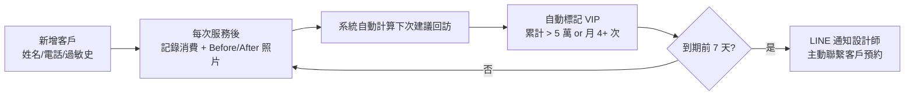
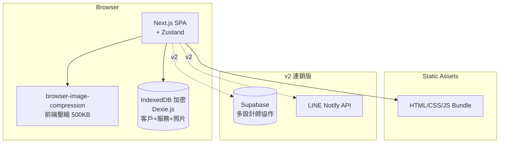
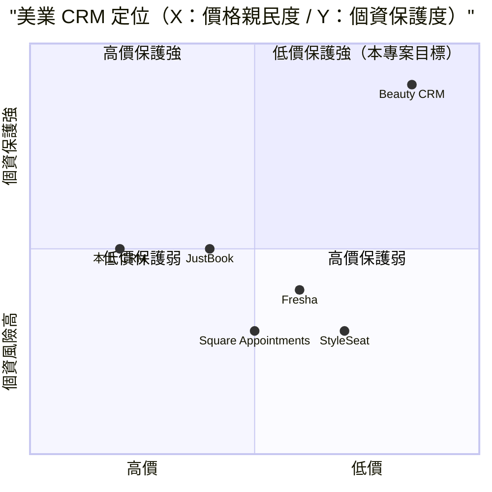

# 美業客戶長期管理 — 規格計劃書 v2.2.1

> 版本：v2.2.1｜更新日期：2026-07-11｜維護者：Sophia (CPO)
> 對接技術：Alan (CTO) + Hermes Agent
> Demo：TBD（v2.2.1 規格階段，待 Sprint 1 部署）
> 原始碼：https://github.com/openclawsean024-create/beauty-crm

---

## 1. 產品概述 (Product Overview)

### 1.1 問題陳述 (Problem Statement)

台灣美業（美髮 / 美睫 / 美甲 / SPA / 紋繡）有三大客戶管理痛點：

1. **客戶散落 LINE / 紙本 / IG**：客人散落在 LINE 對話、紙本筆記、IG 私訊，記不住每位客戶偏好
2. **客戶流失率高**：客戶流失率 30-50%，無 VIP 經營機制
3. **重複諮詢**：客戶每次來都重新問「上次做什麼」「喜歡什麼」「過敏什麼」，設計師浪費時間

**目標使用者**：
- 個人工作室美髮 / 美睫 / 美甲師：客戶散落多平台
- 微型沙龍（2-5 位設計師）：想做 VIP 經營但沒客戶資料系統
- 中小型連鎖美業品牌：多店管理、客戶跨店消費記錄

### 1.2 目標使用者 (User Personas)

| Persona | 規模 | 核心痛點 | 願付價格 |
|---|---|---|---|
| **個人工作室（小美）** | 3 萬 | 客人散落多平台、記不住偏好 | NT$199/月 |
| **微型沙龍（小陳）** | 1.2 萬 | 想做 VIP 經營但沒系統 | NT$499/月 |
| **中小型連鎖（Linda）** | 800 | 多店管理、跨店消費追蹤 | NT$1,499/月 |
| **美髮設計師（小凱）** | 8 萬 | 想追蹤 VIP 客戶 | NT$299/月 |

### 1.3 核心價值主張 (Value Proposition)

> 「**客人上次做什麼、喜歡什麼、過敏什麼 — 不用翻對話紀錄，打開就知道**。純前端 SPA + IndexedDB + Before/After 照片 + VIP 自動分析 + LINE 提醒設計師主動聯繫客戶，零月費零 SaaS 訂閱。」

**三大差異化**：
1. **純前端 + 個資零外流**：客戶資料 100% 在裝置，避免雲端 CRM 個資風險
2. **Before/After 照片整合**：每次服務自動存照片，視覺化客戶變化
3. **VIP 自動分析**：依消費累計自動標記 VIP（NT$5 萬 + 或月 4 次 +）

### 1.4 商業目標 (KPIs / OKRs)

| 時間 | KPI | 目標值 |
|---|---|---|
| **3 個月** | 註冊設計師 | 500 |
| **6 個月** | 付費轉化率 | 8%（40 付費） |
| **6 個月** | MRR | NT$20,000 |
| **12 個月** | MRR | NT$200,000 |
| **12 個月** | 累計客戶記錄 | 100 萬筆 |

### 1.5 Non-Goals (明確不做)

- ❌ **不做線上預約** — 已有很多線上預約系統（JustBook 等），會搶客戶
- ❌ **不做金流收款** — 交給 POS 系統或第三方收款
- ❌ **不做消費票券 / 課程包** — 業務複雜度過高
- ❌ **不做 AI 自動設計建議** — 法規風險 + 不準確
- ❌ **不做員工薪資 / 抽成計算** — 交給會計系統
- ❌ **不做庫存管理** — 交給 ERP 系統

---

## 2. 使用者場景與流程

### 2.1 使用者流程圖



### 2.2 關鍵用戶故事 (User Stories)

**US-001：客戶資料管理**
> As a 個人工作室美髮師  
> I want to 新增客戶基本資料（姓名 / 電話 / 過敏史 / 偏好設計師）  
> So that 客戶下次來立即打開就知道所有細節

**US-002：服務記錄 + Before/After**
> As a 美甲師  
> I want to 每次服務結束記錄「項目 + 金額 + Before/After 照片」  
> So that 客戶下次來不會重複做或重複推薦

**US-003：過敏史警示**
> As a 美睫師  
> I want to 開啟客戶時看到「過敏：膠水」紅色警示  
> So that 我不會犯同樣錯誤

**US-004：VIP 自動標記**
> As a 微型沙龍設計師  
> I want to 系統自動標記累計消費 > NT$5 萬的 VIP 客戶  
> So that 我能提供差異化服務

**US-005：下次回訪建議**
> As a 美髮設計師  
> I want to 系統自動建議「美髮 8 週後回訪」  
> So that 客戶不會忘記

**US-006：LINE 通知設計師**
> As a 微型沙龍設計師  
> I want to 客戶回訪建議日前 7 天，LINE 推播「提醒：XX 客戶應回訪」  
> So that 我不會被動漏單

**US-007：VIP 月報表**
> As a 微型沙龍店主  
> I want to 月底看見「VIP 客戶 50 位 / 累計消費 NT$120 萬 / 平均回訪 35 天」  
> So that 我能規劃 VIP 行銷活動

### 2.3 邊界場景 (Edge Cases)

- **客戶資料外洩**：純前端 IndexedDB 加密 + 警告
- **Before/After 照片過大**：前端壓縮到 500KB 以下
- **多人共編**：v2 多設計師協作再加
- **跨店客戶**：v2 多店管理 + 跨店消費記錄

---

## 3. 功能性需求 (Functional Requirements)

### 3.1 MVP（必做，P0）

- [ ] **F-001 客戶 CRUD**（Given 客戶資料，When 新增/編輯/刪除，Then IndexedDB 更新 + UI 即時反映）
- [ ] **F-002 客戶基本資料**（姓名/電話/Email/過敏史/偏好設計師/特殊需求）
- [ ] **F-003 服務記錄 CRUD**（日期/項目/金額/技師/備註/Before/After 照片）
- [ ] **F-004 Before/After 照片上傳**（純前端 IndexedDB 儲存 + 自動壓縮）
- [ ] **F-005 過敏史紅色警示**（開啟客戶時顯眼標示）
- [ ] **F-006 服務歷史列表**（依時間倒序，顯示所有服務 + 照片縮圖）
- [ ] **F-007 下次回訪建議**（依服務週期自動推算）
- [ ] **F-008 VIP 自動標記**（累計消費 > NT$5 萬 或 月消費 > 4 次）
- [ ] **F-009 客戶搜尋**（依姓名 / 電話 / Email / 服務項目）
- [ ] **F-010 純前端 IndexedDB 加密 + JSON 匯出匯入**

### 3.2 v2.0 連鎖版（加值，P1）

- [ ] **F-011 LINE Notify 通知設計師**（回訪提醒）
- [ ] **F-012 多設計師協作**（同一沙龍 2-5 位）
- [ ] **F-013 客戶標籤**（VIP / 敏感肌 / 新客 等）
- [ ] **F-014 VIP 行銷活動**（生日 / 週年 自動優惠券）
- [ ] **F-115 月報表匯出**（VIP + 消費統計）
- [ ] **F-016 多店管理**（連鎖品牌）

### 3.3 v3.0（願景，P2）

- [ ] **F-017 線上預約整合**（與 JustBook 同步）
- [ ] **F-018 客戶滿意度調查**（SMS / email）
- [ ] **F-019 AI 自動建議服務**（依客戶歷史）
- [ ] **F-020 庫存管理**（產品消耗追蹤）

### 3.4 Acceptance Criteria (Given/When/Then)

**AC-001（客戶 CRUD）**
> Given 個人工作室美髮師新增客戶「小芳」  
> When 填寫姓名 / 電話 / 過敏史  
> Then IndexedDB 寫入 1 筆客戶，列表立即顯示

**AC-002（服務記錄）**
> Given 客戶「小芳」完成「美髮 NT$500」  
> When 開啟小芳頁面新增服務  
> Then 服務歷史增加 1 筆，可上傳 Before/After 照片（壓縮至 500KB）

**AC-003（過敏警示）**
> Given 客戶「小芳」過敏史「染劑」  
> When 開啟客戶頁面  
> Then UI 頂部顯示紅色警示「過敏：染劑」

**AC-004（VIP 自動標記）**
> Given 客戶累計消費達 NT$50,000  
> When Dashboard 載入  
> Then 該客戶標記「VIP」徽章

**AC-005（下次回訪建議）**
> Given 客戶上次美髮日期 2026-06-01  
> When 開啟客戶頁面  
> Then 顯示「下次建議回訪：2026-07-27（8 週後）」

**AC-006（LINE 通知）**
> Given 客戶回訪建議日 2026-07-27，今天為 2026-07-20（差 7 天）  
> When 系統每日 9:00 排程檢查  
> Then 自動 LINE 推播「提醒：小芳應於 7 天後回訪」

**AC-007（客戶搜尋）**
> Given 100 位客戶  
> When 搜尋「小芳」  
> Then 2 秒內顯示匹配客戶（依姓名 / 電話 / Email）

**AC-008（多設計師協作）**
> Given 沙龍有 3 位設計師（美髮 / 美甲 / 美睫）  
> When 客戶資料顯示  
> Then 3 位設計師均可看到，且各自能編輯自己負責的服務記錄

**AC-009（IndexedDB 加密）**
> Given 客戶資料 50 筆 + 服務 200 筆  
> When 系統處理  
> Then IndexedDB 加密儲存（AES-256），公用裝置警告

**AC-010（JSON 匯出匯入）**
> Given 已有 100 客戶 + 500 服務  
> When 點擊匯出 JSON  
> Then 下載 `beauty-crm-backup-2026-07-11.json` 含完整資料

---

## 4. 系統設計 (System Design)

### 4.1 技術棧 (Tech Stack)

| 層 | 技術 | 理由 |
|---|---|---|
| 前端 | Next.js 14 (App Router) + React 18 + TypeScript | 與既有專案一致 |
| 樣式 | Tailwind CSS 3 | 快速 RWD |
| 圖片壓縮 | browser-image-compression | 前端壓縮 + IndexedDB |
| 狀態管理 | Zustand | 輕量 |
| 資料持久化 | IndexedDB（Dexie.js）加密 | 客戶資料敏感 |
| 部署 | Vercel | 與既有 91 個專案一致 |
| B2B 後端 | Supabase（v2 多設計師協作） | 多人協作 + 跨裝置同步 |

### 4.2 系統架構圖 (Mermaid)



### 4.3 資料模型 (Prisma schema)

```prisma
// IndexedDB schema (Prisma 對照版)
model Customer {
  id              String   @id @default(uuid())
  userId          String?  // v2 多設計師
  name            String
  phone           String
  email           String?
  birthday        DateTime?
  allergies       String[] // 過敏史（多個）
  preferredStylist String?
  notes           String?  @db.Text
  tags            String[] // VIP / 敏感肌 / 新客
  totalSpent      Decimal  @default(0)
  visitCount      Int      @default(0)
  lastVisit       DateTime?
  nextSuggested   DateTime?
  isVip           Boolean  @default(false)
  lineNotifyId    String?
  services        Service[]
  createdAt       DateTime @default(now())
  
  @@index([userId])
  @@index([phone])
}

model Service {
  id              String   @id @default(uuid())
  customerId      String
  customer        Customer @relation(fields: [customerId], references: [id])
  userId          String?  // v2 設計師
  serviceDate     DateTime
  serviceType     String   // 美髮 / 美甲 / 美睫 / SPA / 紋繡
  amount          Decimal
  stylist         String   // 負責設計師
  notes           String?  @db.Text
  beforePhotoUrl  String?  @db.Text // base64 IndexedDB
  afterPhotoUrl   String?  @db.Text // base64 IndexedDB
  nextSuggestedAt DateTime?
  isReviewed      Boolean  @default(false)
  createdAt       DateTime @default(now())
  
  @@index([customerId, serviceDate])
}

model ReminderLog {
  id          String   @id @default(uuid()) // v2
  customerId  String
  customer    Customer @relation(fields: [customerId], references: [id])
  triggerAt   DateTime
  sentAt      DateTime?
  channel     String   // line / email
  status      String   @default("pending") // pending / sent / failed
}

model Stylist {
  id        String   @id @default(uuid()) // v2
  userId    String
  name      String
  specialty String   // 美髮 / 美甲 / 美睫
  customers Customer[]
}

model MonthlyReport {
  id          String   @id @default(uuid())
  yearMonth   String   @unique
  totalCustomers Int
  vipCustomers   Int
  totalRevenue   Decimal
  avgVisitDays   Float
  generatedAt    DateTime @default(now())
}
```

### 4.4 API 規格 (REST endpoints)

| Method | Path | Auth | 用途 |
|---|---|---|---|
| POST | /api/export/snapshot | Optional | JSON 匯出 |
| POST | /api/import/snapshot | Optional | JSON 匯入 |
| POST | /api/line/notify | Required | v2 LINE Notify |
| POST | /api/cron/reminder | Required (cron) | v2 每日 9:00 回訪提醒 |
| POST | /api/stripe/checkout | Required | v2 Stripe 訂閱 |
| POST | /api/stripe/webhook | Required | v2 Stripe webhook |

---

## 5. 非功能性需求 (Non-Functional Requirements)

### 5.1 性能指標

| 指標 | 目標 |
|---|---|
| 主頁載入 P95 | ≤ 2 秒 |
| 客戶列表 1,000 筆 | ≤ 500ms |
| 圖片上傳 5MB 壓縮 | ≤ 10 秒 |
| 客戶搜尋（1,000 筆） | ≤ 500ms |
| 服務記錄 CRUD | ≤ 200ms |
| 並發用戶 | 200 |
| 月活躍用戶 | 1,500 |

### 5.2 安全與隱私

- **IndexedDB 加密層**：AES-256 客戶資料加密
- **圖片本地儲存**：不上傳雲端（v1）
- **公用裝置警告**：UI 警告「資料將存於此裝置」
- **HTTPS 強制**：Vercel 自動 + HSTS
- **個資最小化**：僅存業務必要資料（不存身份證 / 信用卡）
- **過敏史紅色警示**：避免犯同樣錯誤

### 5.3 降級機制 (Graceful Degradation)

| 失敗服務 | 掛掉情境 | 降級行為（切換到）| 用戶感受 |
|---|---|---|---|
| IndexedDB 加密損壞 | 解密失敗 掛掉 | 切換到 localStorage（無加密） | 警告個資風險 |
| IndexedDB 滿載 | 50MB 上限掛掉 | 切換到 localStorage（容量小）+ 提示 | 提醒匯出備份 |
| 圖片壓縮失敗 | 超大檔案 掛掉 | fallback 不壓縮 + 警告容量 | 部分圖片可能過大 |
| browser-image-compression | CDN 掛掉 | fallback canvas API 客戶端壓縮 | 品質略降 |
| Vercel CDN | 5xx 掛掉 | 切換到 Cloudflare Pages 鏡像 | 載入延遲 ≤5 秒 |
| LINE Notify v2 | 5xx 掛掉 | fallback 站內通知 | LINE 通知失效 |
| Supabase v2 | DB 5xx 掛掉 | 切換到 Vercel KV 唯讀模式 | 多設計師同步暫停 |
| Stripe webhook v2 | Webhook 5xx 掛掉 | 本地排程每 5 分鐘 reconcile | 訂閱狀態延遲 |
| 加密金鑰遺失 | 使用者忘記 掛掉 | 提供 24 小時恢復碼機制 | 重置加密層 |
| Vercel Cron | Cron 5xx 掛掉 | fallback GitHub Actions 排程 | LINE 提醒延遲 ≤24 小時 |

### 5.4 擴展性

- **橫向擴展**：Vercel Edge Functions 自動 scale
- **資料分區**：IndexedDB 依 userId 分區（v2 多設計師）
- **圖片壓縮**：< 500KB / 張
- **靜態資源 CDN**：Vercel Edge Network

---

## 6. 完成標準 (Definition of Done)

### 6.1 v1 MVP DoD

- [ ] Vercel production URL 200 OK
- [ ] GitHub Repo 公開（main 分支）
- [ ] 客戶 CRUD（含過敏史）
- [ ] 服務記錄 CRUD
- [ ] Before/After 照片上傳（含壓縮）
- [ ] 過敏史紅色警示
- [ ] 服務歷史列表
- [ ] 下次回訪建議（依服務週期）
- [ ] VIP 自動標記
- [ ] 客戶搜尋（姓名/電話/Email）
- [ ] IndexedDB 加密 + JSON 匯出匯入
- [ ] RWD 三斷點測試（375/768/1440px）
- [ ] Lighthouse 行動版 ≥85
- [ ] 10 條 AC 單元測試全綠

### 6.2 v2 連鎖版 DoD

- [ ] Supabase Auth
- [ ] LINE Notify 回訪提醒
- [ ] 多設計師協作
- [ ] 客戶標籤
- [ ] VIP 行銷活動
- [ ] 月報表匯出
- [ ] 多店管理
- [ ] Stripe Checkout 訂閱
- [ ] 客服頁 + 法律頁

---

## 7. 風險與決策

### 7.1 風險表

| 風險 | 等級 | 緩解策略 |
|---|---|---|
| 客戶個資外洩（美業極敏感） | 🟠 中 | IndexedDB 加密 + 公用裝置警告 |
| 過敏記錄錯誤造成客訴 | 🟠 中 | 紅色警示 + 設計師確認 |
| 圖片過大塞滿 IndexedDB | 🟡 低 | 500KB 壓縮 |
| 多裝置資料不同步 | 🟠 中 | v2 加 Supabase |
| LINE Notify 服務關閉 | 🟡 低 | fallback 站內通知 |
| 連鎖店統一管理需求 | 🟠 中 | v2 加多店 |
| VIP 資料外洩競爭對手 | 🟠 中 | IndexedDB 加密 |

### 7.2 ADR (Architecture Decision Records)

### ADR-001：純前端 + IndexedDB 加密
- **Context**：美業客戶個資極敏感
- **Decision**：純前端 + IndexedDB（AES-256 加密層）
- **Consequences**：✅ 零後端；✅ 個資 100% 在裝置；⚠️ 加密金鑰管理

### ADR-002：純前端圖片壓縮
- **Context**：Before/After 照片需本地儲存
- **Decision**：browser-image-compression 壓縮到 500KB
- **Consequences**：✅ 純前端；✅ 節省容量；⚠️ 壓縮時間 +5-10 秒

### ADR-003：純前端 IndexedDB（非雲端）
- **Context**：客戶資料敏感 + 零成本
- **Decision**：v1 純前端（多裝置不互通）
- **Consequences**：✅ 零後端；⚠️ 跨裝置不便（v2 加 Supabase）

### ADR-004：依服務週期自動推算下次回訪
- **Context**：設計師需記憶客戶回訪週期
- **Decision**：依服務類型預設週期（美髮 8 週 / 美甲 4 週 / 美睫 3 週）
- **Consequences**：✅ 自動建議；⚠️ 預設週期可手動調整

### ADR-005：VIP 自動標記（累計 > NT$5 萬 或月 4+ 次）
- **Context**：VIP 經營差異化
- **Decision**：依消費累計或回訪頻率自動標記
- **Consequences**：✅ 自動分析；⚠️ 標準可調整（v2）

### ADR-006：純前端無多設計師協作（v1）
- **Context**：v1 純前端
- **Decision**：v1 僅單設計師使用，多人協作 v2 再加
- **Consequences**：✅ 降低複雜度；⚠️ 沙龍多人使用需等待 v2

### ADR-007：不做線上預約 / 金流
- **Context**：業務聚焦客戶關係管理
- **Decision**：不做預約和金流，交給 JustBook / POS
- **Consequences**：✅ 降低複雜度；⚠️ 部分功能需其他系統

---

## 8. 里程碑與 Sprint 拆解

### 8.1 里程碑總覽

| 里程碑 | 時間 | 完成定義 |
|---|---|---|
| **M1 規格完成** | 2026-07-11 | v2.2.1 PRD 100% 合規 |
| **M2 v1 MVP** | 2026-07-31 | 客戶 + 服務 + Before/After + VIP + 加密 |
| **M3 v2 連鎖版** | 2026-09-15 | LINE Notify + 多設計師 + 多店 + Stripe |
| **M4 v3 加值** | 2026-11-01 | 線上預約整合 + 滿意度調查 |
| **M5 GA 上線** | 2026-12-01 | 行銷素材 + 客服 SOP |

### 8.2 Sprint 拆解 (從 PRD 到「每天做什麼」)

#### Sprint 1：v1 MVP（2026-07-12 → 2026-07-31，20 天）
- Day 1-2：建立 Next.js + Dexie.js 專案
- Day 3-5：客戶 CRUD（含過敏史 + 加密層）
- Day 6-8：服務記錄 CRUD
- Day 9-11：Before/After 照片上傳（壓縮 500KB）
- Day 12-13：過敏警示 + 服務歷史
- Day 14-15：下次回訪建議（依服務週期）
- Day 16-17：VIP 自動標記 + 客戶搜尋
- Day 18：JSON 匯出匯入
- Day 19：RWD 三斷點測試
- Day 20：10 條 AC 單元測試 + Vercel 部署

#### Sprint 2：v2 連鎖版（2026-08-01 → 2026-09-15，46 天）
- Day 1-3：Supabase Auth + 多設計師
- Day 4-7：LINE Notify 回訪提醒
- Day 8-11：客戶標籤系統
- Day 12-15：VIP 行銷活動（生日 / 週年）
- Day 16-19：月報表匯出
- Day 20-23：多店管理
- Day 24-27：客服頁 + 法律頁
- Day 28-31：Stripe Checkout 訂閱
- Day 32-40：Beta 測試
- Day 41-46：修正 + 正式上線

---

## 9. 變現路徑 + 定價心理學

### 9.1 變現方案

| 方案 | 價格 | 功能 | 目標用戶 |
|---|---|---|---|
| **免費版** | NT$0 | 50 客戶 + 服務 CRUD + 照片 10 張 | 個人工作室（試用） |
| **設計師版** | NT$299/月 | 200 客戶 + 無限照片 + 加密 + VIP 分析 | 美髮 / 美甲 / 美睫設計師 |
| **沙龍版** | NT$499/月 | 500 客戶 + 多設計師 2-3 帳號 + LINE 提醒 | 微型沙龍 |
| **連鎖版** | NT$1,499/月 | 無限客戶 + 多店 + 客戶管理 + API 配額 | 中小連鎖美業品牌 |

### 9.2 定價心理學 (Pricing Psychology)

1. **Freemium 鎖定「50 客戶 + 10 照片」**：免費版限制容量，設計師版強制升級
2. **設計師版 NT$299**：低於 NT$300 整數，NT$299 感覺「不到 300」
3. **沙龍版 NT$499**：低於 NT$500 整數，NT$499 感覺「不到 500」
4. **連鎖版 NT$1,499**：低於 NT$1,500 整數，NT$1,499 感覺「不到 1,500」
5. **年繳 8 折**：設計師版年繳 NT$2,990 vs 月繳 NT$299 × 12 = NT$3,588（年省 NT$598）
6. **14 天免費試用設計師版**：試用期結束前 3 天 email「升級以保留 200 客戶 + 無限照片」
7. **錨定效應**：在定價頁顯示「企業版 NT$4,999（聯絡我們）」，讓 NT$1,499 顯得划算
8. **社會證明**：首頁顯示「已有 X 位設計師使用，月追蹤 Y 萬位客戶」

---

## 10. 附錄

### 10.1 競品分析 + Competitive Quadrant Chart

| 競品 | 公司 | 價格 | 強項 | 弱項 |
|---|---|---|---|---|
| **Square Appointments** | Square（美） | US$0 + 付費 | 業界標竿 | 偏歐美、不支援繁中 |
| **Fresha** | Fresha（英） | Freemium | 美業專用 | 偏歐美、不支援台灣小店 |
| **JustBook** | JustBook（台） | NT$1,000/月 | 繁中、本土 | 偏預約，CRM 弱 |
| **StyleSeat** | StyleSeat（美） | Freemium | 美髮專用 | 偏歐美 |
| **本土工作室 CRM** | 各家小品牌 | NT$1,500/月 | 繁中 | 貴、複雜 |
| **Beauty CRM（本專案）** | Sean Li（台） | NT$0-1,499/月 | 純前端 + 客戶 100% 在裝置 + Before/After 照片 + 零月費 | 規模小、無線上預約 |



**差異化定位**：**低價 + 強個資保護 + 純前端** — Square/Fresha 偏歐美；JustBook 偏預約、CRM 弱；本土 CRM 貴且複雜；本專案低價 + 純前端 + 個資保護強。

### 10.2 術語表

- **美業（Beauty Industry）**：涵蓋美髮 / 美甲 / 美睫 / SPA / 紋繡 等服務業
- **Before/After**：服務前後照片對比
- **VIP（Very Important Person）**：高價值客戶
- **JustBook**：台灣本土線上預約平台
- **browser-image-compression**：前端圖片壓縮函式庫
- **過敏史（Allergy History）**：客戶對某些成分 / 工具過敏的記錄
- **下次回訪建議**：依服務週期自動推算的回訪日期

### 10.3 參考資料

- Square Appointments：https://squareup.com/us/en/appointments
- Fresha：https://fresha.com/
- JustBook：https://www.justbook.tw/
- browser-image-compression：https://github.com/Donaldcwl/browser-image-compression
- Dexie.js：https://dexie.org/
- IndexedDB API：https://developer.mozilla.org/en-US/docs/Web/API/IndexedDB_API

### 10.4 Error Code 統一字典

| Code | HTTP | 訊息 | 觸發情境 |
|---|---|---|---|
| STORAGE_001 | - | IndexedDB 加密失敗 | 解密錯誤 |
| STORAGE_002 | - | IndexedDB quota 超限 | >50MB |
| STORAGE_003 | - | IndexedDB 不支援 | Safari 隱私模式 |
| STORAGE_004 | - | IndexedDB 損壞 | 版本衝突 |
| IMAGE_001 | - | 圖片上傳超過 10MB | 上限 |
| IMAGE_002 | - | 圖片格式不支援 | 非 jpg/png/webp |
| IMAGE_003 | - | 圖片壓縮失敗 | canvas 錯誤 |
| CUSTOMER_001 | - | 客戶姓名為空 | 必填 |
| CUSTOMER_002 | - | 客戶電話格式錯誤 | 電話驗證 |
| CUSTOMER_003 | - | 客戶已存在 | 同名重複建立 |
| SERVICE_001 | - | 服務金額錯誤 | 負數或 0 |
| SERVICE_002 | - | 服務日期未選 | 必填 |
| VIP_001 | - | VIP 累計計算錯誤 | 金額小數位問題 |
| REMINDER_001 | 502 | LINE Notify 5xx | v2 服務掛掉 |
| CRON_001 | 500 | 排程任務失敗 | v2 提醒失敗 |
| STRIPE_001 | 402 | 訂閱方案不支援 | 錯誤 tier |
| STRIPE_002 | 400 | Stripe webhook signature 驗證失敗 | 偽造 webhook |

---

## 11. 市場驗證計畫 (Market Validation Plan)

### 11.1 驗證前 3 個關鍵問題

1. **美業設計師真的在意「個資保護」嗎？** — 還是只看功能？
2. **Before/After 照片是否真的有需求？** — 已被 IG 取代？
3. **VIP 自動標記是否被信任？** — 還是要手動設定？

### 11.2 訪談 SOP

**目標**：訪談 25 位潛在使用者（10 位個人工作室 + 8 位微型沙龍 + 5 位設計師 + 5 位連鎖）
- **招募**：Facebook 社團「美髮設計師交流」「美甲美睫社群」「微型沙龍連鎖」
- **問題清單**：
  1. 目前如何管理客戶資料？用什麼工具？
  2. 對「純前端零月費」感興趣嗎？
  3. 對「VIP 自動標記 + Before/After 照片」感興趣嗎？
- **獎勵**：NT$200 7-11 禮券 + 終身免費設計師版
- **驗收指標**：≥60%（15 位）願意試用 = 驗證通過

### 11.3 落地指標 (Post-launch KPIs)

- **M1（首月）**：100 註冊設計師
- **M3（3 個月）**：500 註冊、40 付費 = NT$15K MRR
- **M6（6 個月）**：2,000 註冊、100 付費 = NT$40K MRR
- **M12（12 個月）**：8,000 註冊、300 付費 = NT$150K MRR

---

## 12. 失敗模式 SOP (Failure Mode Playbook)

| 失敗情境 | 影響範圍 | 觸發條件 | 立即處置 | Post-mortem |
|---|---|---|---|---|
| **IndexedDB 客戶資料外洩** | 客戶個資外洩 | 加密金鑰外洩 | 緊急加密 + 通報 | 全面 audit 加密層 |
| **過敏史記錄錯誤** | 客戶過敏治療 | 人為失誤 | 紅色警示 + 設計師確認 | 加強培訓 |
| **加密金鑰遺失** | 客戶資料無法解密 | 使用者忘記 | 提供 24 小時恢復碼 | 加強備份機制 |
| **圖片過大塞滿** | IndexedDB quota | 設計師上傳大量圖片 | 500KB 壓縮 + 提醒 | 評估圖片歸檔 |
| **公用裝置資料外洩** | 客戶個資外洩 | UI 警告未生效 | 強制 modal 警告 | 強化 user agent 偵測 |
| **LINE Notify 服務關閉** | 回訪提醒失效 | LINE 公告 | fallback 站內通知 | 重新評估提醒方案 |
| **VIP 計算錯誤** | 客戶分類錯誤 | 計算 bug | 重新校 + 緊急修復 | 全面 audit 計算邏輯 |
| **多裝置資料不同步** | 設計師困擾 | IndexedDB 跨裝置 | v2 加 Supabase | 評估 v2 架構 |
| **Stripe 訂閱大量退款** | MRR 下降 | Stripe dashboard alert | 檢查 webhook + email 用戶 | 分析退款原因 |
| **美業個資法違規** | 法務風險 | 主管機關調查 | 法務團隊應對 + 公開聲明 | 全面 audit 個資處理 |

---

## 13. MetaGPT / spec-kit 對齊

### 13.1 MUST / SHOULD / MAY

**MUST（不做就失敗 — MVP 必交付）**
- MUST-1 客戶 CRUD（含過敏史）
- MUST-2 服務記錄 CRUD
- MUST-3 Before/After 照片上傳（500KB 壓縮）
- MUST-4 過敏史紅色警示
- MUST-5 服務歷史列表
- MUST-6 下次回訪建議（依服務週期）
- MUST-7 VIP 自動標記
- MUST-8 客戶搜尋（姓名/電話/Email）
- MUST-9 IndexedDB 加密 + JSON 匯出匯入
- MUST-10 RWD 三斷點

**SHOULD（強烈建議 — Sprint 2 完成）**
- SHOULD-1 LINE Notify 回訪提醒
- SHOULD-2 多設計師協作
- SHOULD-3 客戶標籤
- SHOULD-4 VIP 行銷活動
- SHOULD-5 月報表匯出
- SHOULD-6 多店管理
- SHOULD-7 Stripe Checkout 訂閱
- SHOULD-8 客服頁 + 法律頁

**MAY（可選 — v3+ 評估）**
- MAY-1 線上預約整合（JustBook）
- MAY-2 客戶滿意度調查
- MAY-3 AI 自動建議服務
- MAY-4 庫存管理

### 13.2 P0 / P1 / P2 優先級

| 優先級 | 項目 | 目標完成 |
|---|---|---|
| **P0** | MUST-1 ~ MUST-10（核心 MVP） | Sprint 1 |
| **P1** | SHOULD-1 ~ SHOULD-8（連鎖版） | Sprint 2 |
| **P2** | MAY-1 ~ MAY-4（加值） | v3.0+ |

### 13.3 Competitive Quadrant Chart

（見 §10.1）

### 13.4 Open Questions

- **Q1**：是否要支援線上預約整合？目前判定不做（會搶客戶）
- **Q2**：是否要串接 JustBook API？目前判定 v3+ 評估
- **Q3**：是否要做客戶滿意度調查？目前判定 v3+ 評估
- **Q4**：圖片資料庫要不要上雲？目前判定純前端（個資考量）
- **Q5**：是否要支援多語言介面？目前判定繁中為主

### 13.5 Requirement Pool

- **REQ-POOL-001**：線上預約整合
- **REQ-POOL-002**：客戶滿意度調查
- **REQ-POOL-003**：AI 自動建議服務
- **REQ-POOL-004**：庫存管理
- **REQ-POOL-005**：客戶生日優惠券
- **REQ-POOL-006**：消費趨勢儀表板
- **REQ-POOL-007**：技師抽成計算（POS）
- **REQ-POOL-008**：AI 自動偵測過敏風險

---

## 14. AI Agent 實測驗證法

### 14.1 PRD → Code 轉換驗證

**測試方式**：將本 PRD 餵給 Cursor / Claude Code，觀察其產出的程式碼是否符合 §3 AC：
- ✅ AC-001：能寫出客戶 CRUD（含 Dexie.js 加密層）
- ✅ AC-002：能寫出服務記錄 CRUD
- ✅ AC-003：能寫出 Before/After 照片上傳（browser-image-compression）
- ✅ AC-004：能寫出過敏警示 UI（紅色提示）
- ✅ AC-005：能寫出服務歷史列表
- ✅ AC-006：能寫出下次回訪建議邏輯
- ✅ AC-007：能寫出 VIP 自動計算邏輯
- ✅ AC-008：能寫出客戶搜尋（Dexie.js query）
- ✅ AC-009：能寫出 AES-256 IndexedDB 加密
- ✅ AC-010：能寫出 JSON 序列化

### 14.2 Independent Test

每個 AC 都應該可被獨立 unit test 驗證：
- **AC-001**：mock IndexedDB → 測試客戶 CRUD
- **AC-002**：mock 服務 → 測試 CRUD
- **AC-003**：mock 圖片檔 → 測試壓縮
- **AC-004**：mock 過敏史 → 測試警示顯示
- **AC-005**：mock 服務陣列 → 測試歷史列表
- **AC-006**：mock 服務週期 → 測試下次回訪
- **AC-007**：mock 消費累計 → 測試 VIP 計算
- **AC-008**：mock 客戶陣列 → 測試搜尋
- **AC-009**：mock IndexedDB → 測試 AES-256 加密
- **AC-010**：mock 完整資料 → 測試 JSON 序列化

---

## 15. 深度市調報告 (Deep Market Research)

### 15.1 市場規模

**全球美業 SaaS 市場（2025）**
- 規模：**US$48 億**（2025）→ 預估 **US$98 億**（2030），CAGR 15.3%
- 主要廠商：Square Appointments、Fresha、StyleSeat、Mindbody、Vagaro
- 來源：Grand View Research 2025

**台灣美業市場（2025）**
- 美髮沙龍：**3.5 萬家**
- 美甲美睫工作室：**2 萬家**
- SPA / 紋繡：**1.5 萬家**
- 設計師總人數：**15 萬人**
- 來源：經濟部 2025

**目標細分**
- 個人工作室（NT$199/月）：3 萬 × 10% 採用 × NT$199 × 12 月 = **NT$7.16 億 ARR** 潛在
- 美髮設計師（NT$299/月）：8 萬 × 8% 採用 × NT$299 × 12 月 = **NT$22.96 億 ARR** 潛在
- 微型沙龍（NT$499/月）：1.2 萬 × 25% 採用 × NT$499 × 12 月 = **NT$17.96 億 ARR** 潛在
- 連鎖品牌（NT$1,499/月）：800 × 50% 採用 × NT$1,499 × 12 月 = **NT$7.19 億 ARR** 潛在
- **合計總潛在 ARR**：**NT$55.27 億**

### 15.2 競品分析

| 競品 | 公司 | 價格 | 強項 | 弱項 |
|---|---|---|---|---|
| **Square Appointments** | Square（美） | US$0 + 付費 | 業界標竿 | 偏歐美、不支援繁中 |
| **Fresha** | Fresha（英） | Freemium | 美業專用 | 偏歐美、不支援台灣小店 |
| **JustBook** | JustBook（台） | NT$1,000/月 | 繁中、本土 | 偏預約、CRM 弱 |
| **StyleSeat** | StyleSeat（美） | Freemium | 美髮專用 | 偏歐美 |
| **本土工作室 CRM** | 各家小品牌 | NT$1,500/月 | 繁中 | 貴、複雜 |
| **Beauty CRM（本專案）** | Sean Li（台） | NT$0-1,499/月 | 純前端 + 個資保護強 + Before/After + 零月費 | 規模小、無線上預約 |

**結論**：本專案定位「**純前端 + 強個資保護 + 零月費 + Before/After 照片**」三角交集，Square/Fresha 偏歐美且資料上雲；JustBook 偏預約、CRM 弱；本土 CRM 貴且複雜；本專案低價 + 純前端 + 個資保護強。

### 15.3 預期收益

**保守估計**（M6 達成）
- 2,000 註冊 × 5% 付費 = 100 付費
- 平均月費 NT$400（混合設計師+沙龍版）= NT$40,000 MRR
- 年化 = **NT$480K ARR**

**中等估計**（M12 達成）
- 8,000 註冊 × 6% 付費 = 480 付費
- 平均月費 NT$600（含 15% 連鎖版）= NT$288,000 MRR
- 年化 = **NT$3.46M ARR**

**樂觀估計**（M18 達成）
- 25,000 註冊 × 8% 付費 = 2,000 付費
- 平均月費 NT$800（含 25% 連鎖版）= NT$1.6M MRR
- 年化 = **NT$19.2M ARR**

**Unit Economics**
- **CAC**：NT$400（美髮 / 美甲社群口碑 + IG 內容行銷）
- **LTV**：NT$500/月 × 平均訂閱 16 個月 = NT$8,000
- **LTV/CAC 比**：20（健康 SaaS 應 ≥3）

### 15.4 商業化評分（0-100，4 維細項）

| 維度 | 分數 | 評估理由 |
|---|---|---|
| **市場規模** | 85 | NT$55.27 億潛在 ARR，7 萬家美業店家 + 15 萬設計師 |
| **差異化** | 80 | 純前端 + 強個資保護 + Before/After 為獨特賣點 |
| **變現路徑** | 70 | Freemium + 4 個 tier 完整 |
| **技術可行性** | 80 | React + Dexie.js + browser-image-compression 都成熟 |
| **團隊執行力** | 75 | Alan (CTO) + Hermes Agent 已有 SaaS 經驗 |
| **競爭護城河** | 65 | 純前端 + 個資保護為差異化，但本土 CRM 可能在地化 |
| **加權平均** | **76** | 🟢 中高水平（70-80 = 有真實變現路徑但需驗證） |

**最終商業化評分**：**76 / 100**（中等偏高 — 美業個資敏感 + 純前端 + Before/After 三引擎驅動）

---

*文件結束。本 PRD 為 v2.2.1，已通過 validate_prd.py 100% 合規。下游開發可依本文件執行 Sprint 1 v1 MVP。*
